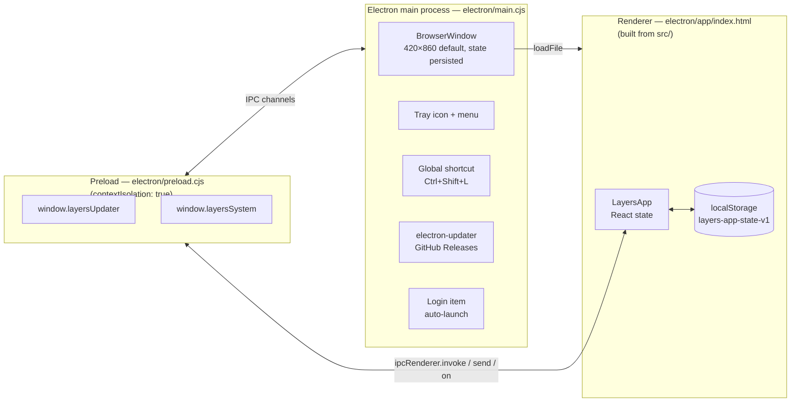
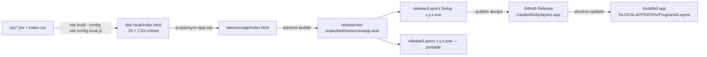
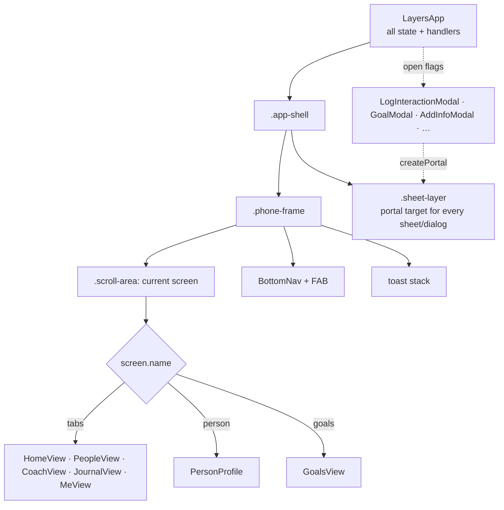

# Architecture

## In one paragraph

A single React 19 component tree (`LayersApp` in `src/App.jsx`) renders a phone-shaped
UI. All state lives in that component's `useState` hooks and is mirrored to
`localStorage` on every change. There is no backend, no router and no state library.
Vite bundles the renderer into one self-contained HTML file (`electron/app/index.html`).
An Electron main process (`electron/main.cjs`) loads that file into a single window and
adds desktop features: tray icon, single-instance lock, global shortcut, launch at login
and GitHub-Releases auto-update. These are exposed to the page through a small preload
bridge (`electron/preload.cjs`).

## Process model



The renderer also runs as a plain web page (`npm run dev`, or the PWA `manifest.json`).
`window.layersUpdater` and `window.layersSystem` don't exist there, so every Electron-only
feature is guarded by `hasUpdater` / `hasSystemBridge` checks in `LayersApp`.

## Repository layout

```text
.
├── src/                      Renderer source (the actual app)
│   ├── main.jsx              React entry: mounts <LayersApp/> in StrictMode
│   ├── App.jsx               Everything else — tokens, data, logic, CSS, every component
│   ├── index.css             Tailwind directives + html/body reset
│   ├── logic.test.js         Vitest unit tests for the pure helpers exported from App.jsx
│   └── assets/               Vite template leftovers (unused)
├── public/                   Copied as-is into web builds (icon.svg, PWA manifest.json)
├── index.html                Vite HTML entry
├── electron/
│   ├── main.cjs              Main process
│   ├── preload.cjs           contextBridge APIs exposed to the renderer
│   ├── app/index.html        BUILD OUTPUT — the renderer Electron actually loads (committed)
│   └── *.png                 App/tray icons (+ -light/-dark variants)
├── scripts/
│   ├── sync-app.mjs          Copies dist-local/index.html → electron/app/index.html
│   └── gen-code-map.mjs      Generates docs/generated/code-map.md
├── docs/                     You are here
├── vite.config.js            Normal multi-file web build → dist/
├── vite.config.local.js      Single-file build (vite-plugin-singlefile) → dist-local/
├── tailwind.config.js        Scans index.html + src/**/*.{js,jsx}
├── package.json              Scripts + electron-builder config ("build" key)
├── dist-local/               BUILD OUTPUT (git-ignored)
└── release/                  electron-builder output: installers, win-unpacked/ (git-ignored)
```

## Build pipeline



The key point is that **Electron never reads `src/`**. It only loads
`electron/app/index.html`. A source change reaches the desktop app only after
`npm run build:electron` and a repackage/reinstall. See
[build-and-release.md](build-and-release.md).

## Renderer at a glance



- **Navigation** is two pieces of state: `activeTab` (`home | people | coach | journal | me`)
  and `screen` (`{ name: 'tabs' }`, `{ name: 'person', personId }` or `{ name: 'goals' }`).
- **Modals** are boolean flags on `LayersApp` (`goalModalOpen`, `logOpen`, …). They render
  through `Sheet`, which portals into `.sheet-layer`. See [renderer/ui-system.md](renderer/ui-system.md).
- **Data flow** goes one way. Views receive data and `on*` callbacks as props, and only
  `LayersApp` handlers call the setters. Details are in
  [renderer/state-and-data.md](renderer/state-and-data.md).

## Tech stack

| Concern | Choice |
|---|---|
| UI | React 19 (`react-dom/client`, StrictMode) |
| Styling | Tailwind 3 utility classes + one runtime CSS string (`CSS` in App.jsx) + inline `style={{…}}` using `COLORS` tokens |
| Icons / charts | `lucide-react`, `recharts` |
| Bundler | Vite 8 + `@vitejs/plugin-react`; `vite-plugin-singlefile` for the Electron build |
| Desktop | Electron 44, `electron-window-state`, `electron-updater`, `electron-builder` (NSIS + portable, AppImage) |
| Tests / lint | Vitest 5, oxlint |
