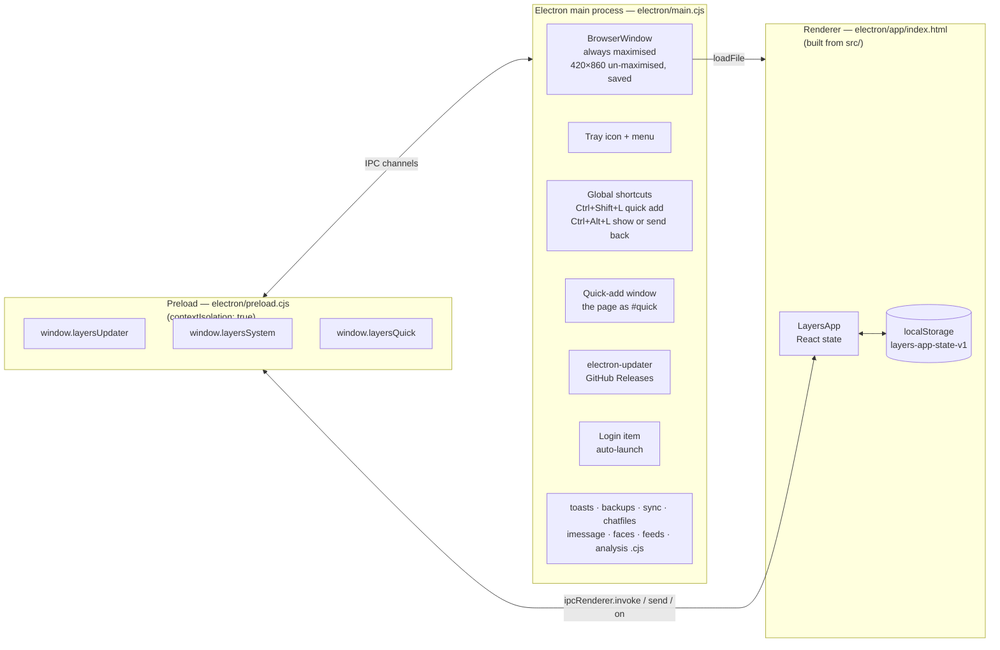
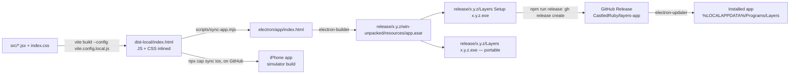

# Architecture

## In one paragraph

A single React 19 component tree (`LayersApp` in `src/App.jsx`) renders a phone-shaped
UI, which fills the window once it's 900 px or wider. All state lives in that component's
`useState` hooks and is mirrored to `localStorage` on every change. There is no backend,
no router and no state library. Vite bundles the renderer into one self-contained HTML
file (`electron/app/index.html`). An Electron main process (`electron/main.cjs`) loads
that file into a single window and adds desktop features: tray icon, single-instance
lock, global shortcuts and the quick-add box, launch at login and GitHub-Releases
auto-update. It also does what the page can't do itself, each in its own module in
`electron/`: Windows notifications, daily backups, the encrypted OneDrive sync file, chat
exports and iMessage chats from an iPhone backup, faces in photos, other calendars and chat analysis with Claude (see
[electron.md](electron.md)). These are exposed to the page through a small preload bridge
(`electron/preload.cjs`). The calendar's notifications are scheduled with Windows, so
they arrive even when Layers is closed; the daily check-in nudge comes from the page
itself, which keeps running while the window is hidden in the tray.

## Process model



The renderer also runs as a plain web page (`npm run dev`, or the PWA `manifest.json`),
and in the iPhone app (Capacitor, [build-and-release.md](build-and-release.md#the-iphone-app-built-on-github-no-apple-account-yet)).
`window.layersUpdater` and `window.layersSystem` don't exist there, so every Electron-only
feature is guarded by `hasUpdater` / `hasSystemBridge` checks in `LayersApp`.

## Repository layout

```text
.
├── src/                      Renderer source (the actual app)
│   ├── main.jsx              React entry: mounts <LayersApp/>, or <QuickAdd/> as #quick, in StrictMode
│   ├── App.jsx               LayersApp: all state, handlers, shortcuts, layout
│   ├── QuickAdd.jsx          The quick-add box (Ctrl+Shift+L), the same page opened as #quick
│   ├── theme.js              Design tokens + the global CSS string
│   ├── fonts.js              Bundled Fraunces/Manrope @font-face rules (works offline)
│   ├── data/                 Static data (constants, seed, avatars, coach scenarios)
│   ├── lib/                  Logic: dates, progress, calendar, storage, backup, sync, chats and analysis, … (+ hooks)
│   ├── components/           Shared UI: Sheet, atoms, rows, pickers, BottomNav
│   ├── modals/               One file per sheet/dialog
│   ├── views/                One file per screen
│   ├── index.css             Tailwind directives + html/body reset
│   └── *.test.js             Vitest unit tests for lib/ and data/, and for the electron/ and scripts/ modules
├── tests/
│   ├── setup.js              Vitest setup (jsdom helpers for the app tests)
│   ├── app/                  App tests: the whole renderer in jsdom, driven like a person would
│   └── e2e/                  End-to-end tests: Playwright drives the packaged Layers.exe
├── public/                   Copied as-is into web builds (icon.svg, PWA manifest.json)
├── index.html                Vite HTML entry
├── electron/
│   ├── main.cjs              Main process
│   ├── preload.cjs           contextBridge APIs exposed to the renderer
│   ├── toasts.cjs            Schedules the calendar's Windows notifications (toast XML, PowerShell)
│   ├── backups.cjs           Daily backups in Documents\Layers backups, the newest 14
│   ├── sync.cjs              Moves the encrypted OneDrive sync file; keeps its passphrase
│   ├── chatfiles.cjs         Reads chat exports from Documents\Layers chats
│   ├── imessage.cjs          Reads iMessage chats from the newest iPhone backup on this laptop
│   ├── faces.cjs             Finds faces in photos with Windows' own face detector
│   ├── feeds.cjs             Other calendars: keeps the iCal addresses, downloads them
│   ├── analysis.cjs          Chat analysis with Claude: keeps the API key, sends the request
│   ├── app/index.html        BUILD OUTPUT — the renderer Electron actually loads (committed)
│   ├── icon.ico, icon.png    Exe, installer and window icon (made by npm run brand:render)
│   ├── tray-icon-*.png       Tray icons for a light (-dark) or dark (-light) taskbar, with @2x
│   └── installer-sidebar.bmp The installer's side panel
├── scripts/
│   ├── sync-app.mjs          Copies dist-local/index.html → electron/app/index.html
│   ├── check-fresh-build.cjs electron-builder's beforePack: refuses to package an old build of the page
│   ├── gen-code-map.mjs      Generates docs/generated/code-map.md
│   ├── verify.mjs            npm run verify: lint, code-map check, tests, build
│   ├── e2e.mjs               npm run test:e2e: packages the app, runs Playwright
│   ├── install-hooks.mjs     npm install's "prepare": points git at .githooks/
│   ├── install-local.mjs     npm run install:local: installs the current code on this computer
│   ├── render-brand.cjs      npm run brand:render: draws the icons from branding/
│   └── release.mjs           npm run release
├── .githooks/
│   ├── pre-commit            Regenerates the code map and runs npm run verify
│   └── post-commit, post-merge   Run install-local.mjs, so every commit is installed here
├── branding/                 Logo and icon drafts (README.md says which file is what)
├── ios/                      The iPhone app's Xcode project (Capacitor); its copy of the page is git-ignored
├── .github/workflows/ios.yml Builds the iPhone app for the simulator on GitHub after a push to main
├── docs/                     You are here
├── CLAUDE.md                 Short working rules for Claude Code sessions
├── vite.config.js            Normal multi-file web build → dist/, and the Vitest config
├── vite.config.local.js      Single-file build (vite-plugin-singlefile) → dist-local/
├── capacitor.config.json     The iPhone app: id, name, and dist-local/ as its page
├── playwright.config.js      End-to-end test config (tests/e2e, one app at a time)
├── tailwind.config.js        Scans index.html + src/**/*.{js,jsx}
├── package.json              Scripts + electron-builder config ("build" key)
├── dist-local/               BUILD OUTPUT (git-ignored)
├── dist-e2e/                 The app npm run test:e2e packages and tests (git-ignored)
├── dist-install/             The installer install-local.mjs builds and runs (git-ignored)
└── release/                  electron-builder output, one folder per version: installers, win-unpacked/ (git-ignored)
```

The tests and the pre-commit hook are explained in [testing.md](testing.md), and the
install after every commit in
[build-and-release.md](build-and-release.md#every-commit-is-installed-on-this-computer).

## Build pipeline



The key point is that **Electron never reads `src/`**. It only loads
`electron/app/index.html`. A source change reaches the desktop app only after
`npm run build:electron` and a repackage/reinstall; the post-commit hook does both for
every commit that changes the app, and `scripts/check-fresh-build.cjs` refuses to package a page built from
older source. See [build-and-release.md](build-and-release.md).

## Renderer at a glance


- **Navigation** is two pieces of state: `activeTab` (`today | people | coach | journal | me`)
  and `screen` (`{ name: 'tabs' }`, `{ name: 'person', personId }` or `{ name: 'goals' }`).
- **Modals** are boolean flags on `LayersApp` (`goalModalOpen`, `logOpen`, …). They render
  through `Sheet`, which portals into `.sheet-layer`. See [renderer/ui-system.md](renderer/ui-system.md).
- **Data flow** goes one way. Views receive data and `on*` callbacks as props, and only
  `LayersApp` handlers call the setters. Details are in
  [renderer/state-and-data.md](renderer/state-and-data.md).

## Tech stack

| Concern | Choice |
|---|---|
| UI | React 19 (`react-dom/client`, StrictMode) |
| Styling | Tailwind 3 utility classes + one runtime CSS string (`CSS` in `theme.js`) + inline `style={{…}}` using `COLORS` tokens |
| Icons / charts | `lucide-react`, `recharts` |
| Bundler | Vite 8 + `@vitejs/plugin-react`; `vite-plugin-singlefile` for the Electron build |
| Desktop | Electron 44, `electron-window-state`, `electron-updater`, `electron-builder` (NSIS + portable, AppImage) |
| Chat analysis | `@anthropic-ai/sdk`, in the main process only (`electron/analysis.cjs`) |
| iPhone | Capacitor 8 (`@capacitor/ios`), built for the simulator on GitHub (`.github/workflows/ios.yml`) |
| Tests / lint | Vitest 5 with Testing Library and jsdom (unit and app tests), Playwright (end-to-end tests of the packaged app), oxlint. See [testing.md](testing.md). |
