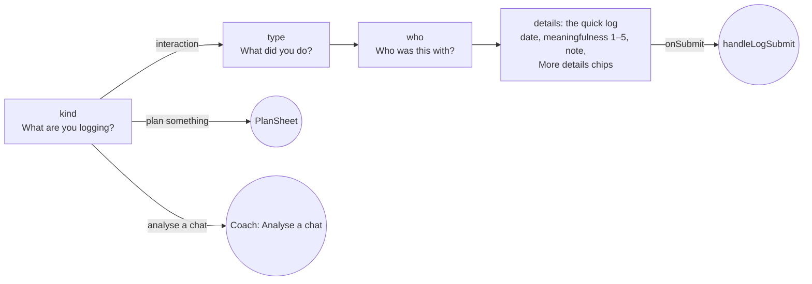

# Renderer structure (`src/`)

The renderer is split by role. Imports only point down the list below, so there are no
circular imports:

```text
src/main.jsx                  mounts <LayersApp/> (or <QuickAdd/> for #quick)
src/App.jsx                   LayersApp: all state, handlers, keyboard shortcuts, Electron wiring, layout
src/QuickAdd.jsx              the quick-add box (below)
src/theme.js                  design tokens (THEME_*, COLORS) and the global CSS string
src/data/                     static data: no React, no logic
src/lib/                      pure logic: no React (except hooks.js), unit-tested
src/components/               shared UI pieces
src/modals/                   one file per sheet/dialog
src/views/                    one file per screen
```

Line-numbered tables of every file, component (with props and "rendered by"), function
and constant are in [../generated/code-map.md](../generated/code-map.md).

## File layout

| File | What lives there |
|---|---|
| [`theme.js`](../../src/theme.js) | `THEME_LIGHT` / `THEME_DARK` palettes, `COLORS` (CSS-variable references), and the `CSS` string injected by `<style>{CSS}</style>`: theme variables, phone frame, sheet layer, nav, FAB, toasts, animations. See [ui-system.md](ui-system.md). |
| [`fonts.js`](../../src/fonts.js) | The bundled Fraunces and Manrope `@font-face` rules (`FONT_FACES`), used at the top of `CSS` |
| [`data/constants.js`](../../src/data/constants.js) | `LAYERS` (the 4 relationship layers), the six dimensions (`DIM_*`) and new people's starting values (`LAYER_BASE_DIMS`), info `CATEGORIES`, the bottom tabs' order (`TABS`), keyboard `SHORTCUTS`, emoji lists, `ACTIVITY_TEMPLATES` (the log's Add detail: what you did together) and `activityTemplatesFor`, `NOTE_TEMPLATES` (interest topics) and where one is saved (`NOTE_TEMPLATE_CATEGORY`), Something new's suggestions (`INFO_TEMPLATES`), How it felt's phrases (`REFLECTION_TEMPLATES`), Coach tips by kind of plan (`PLAN_TIPS`), `ML_LABELS` (how meaningful, 1–5), goal `PRESETS` + `PRESET_VARIANTS`, which skill each skill goal follows (`SKILL_GOAL_PRESETS`, `SKILL_GOAL_STEP`), interaction `TYPE_META`, active-listening `AL_ITEMS`, the log's "What stood out?" (`STANDOUTS`, `STANDOUT_BUMP`), `CONV_STATES`, `ACHIEVEMENTS`, onboarding `FOCUS_OPTIONS`, skills order and the Me tab's per-skill tips (`SKILL_TIPS`) |
| [`data/avatars.js`](../../src/data/avatars.js) | A person's avatars: `AVATAR_GROUPS` (People, Faces, Animals, Things, each a whole number of 8-wide rows), `SKIN_TONES`, and `withTone` / `splitTone` / `groupOf` / `avatarName`; and initials, `INITIAL_COLORS`, `INITIALS_GROUP`, `initialsOf` ("EM", "Is"), `isInitials`; and photos, `PHOTO_GROUP`, `isPhoto`, `photoBox` (where a picture sits in the circle), where a picture starts (`startCrop`, `faceCrop`, `cropAround`), `isPictureFile` and `personForFile` (for a folder of photos), with `cleanAvatar` for saved data and `findAvatars` (/ in the picker). The emoji is one string with any tone inside it; initials and photos are `person.avatar`, which `Avatar` (`components/atoms.jsx`, given `person`) draws instead |
| [`lib/photo.js`](../../src/lib/photo.js) | Photos for avatars: `loadPhoto` reads a chosen picture (up to 25 MB), `renderPhoto` draws the cropped circle as a 160 px JPEG. Only that small image is kept. `findFaces` asks Windows' face detector (through the bridge) where the faces are. `shrinkForAnalysis` makes a screenshot at most 1568 px long, as JPEG, for chat analysis |
| [`data/seed.js`](../../src/data/seed.js) | Example people, goals, journal and skills (`INITIAL_*`), `EMPTY_SKILLS`. Each sample person sits exactly where Adjust would place them. |
| [`data/scenarios.js`](../../src/data/scenarios.js) | `SCENARIOS`: the four sample chats in the Coach "Analyse" tab, with transcripts and gradings. A real chat's analysis has the same shape ([lib/analysis.js](../../src/lib/analysis.js)). |
| [`lib/util.js`](../../src/lib/util.js) | `clamp`, `uid` |
| [`lib/dates.js`](../../src/lib/dates.js) | Every date helper: relative/absolute labels, chart history (`sortHistory`, `pushHistoryPoint`), the stored-`at` helpers for journal entries, info items and timeline steps, date ordering (`newestFirst`, `sortByDay`), and the `backfill*` loaders. See [state-and-data.md](state-and-data.md#dates-store-the-day-derive-the-label). |
| [`lib/progress.js`](../../src/lib/progress.js) | The progression model: `computeOverall`, `layerForOverall`, `advanceLayer`, `placeOnLayers`, `progressDelta`, `dimsEqual`, `chartDay`, `movePerson`, `makePerson`, `bumpSkills`, `raisedSkills`, `advanceSkillGoals`, `generateGoalDescription`, how much a log grows each dimension and goal (`dimBumps`, `goalBumpFor`), and keeping the dimensions inside the layer's band (`layerDimBounds`, `scaleDimsToSum`, `keepDimsInLayer`, `migrateDimsToLayers`). See [state-and-data.md](state-and-data.md#progression-model). |
| [`lib/closeness.js`](../../src/lib/closeness.js) | The closeness quiz: `QUIZ` (eleven questions, Layer 1 to 4), `ANSWERS` (Yes, Sort of, No), `nextQuestion` (stops once a layer isn't reached) and `quizPlacement` (the layer and how far into it). See [state-and-data.md](state-and-data.md#where-new-people-start) |
| [`lib/text.js`](../../src/lib/text.js) | Sentence builders: `summaryFor`, `homeGoalTitle`, `generateSuggestions`, `getCheckInSuggestions`, `checkInReminder`, `buildPotentialHooks` (Prepare's hooks, [below](#prepares-hooks)), `focusSuggestion` (Today's "Try this next"), `updateStatusText` |
| [`lib/storage.js`](../../src/lib/storage.js) | `loadSavedState` (checks saved data at startup) / `persistState` (the `layers-app-state-v1` key), and the notification bookkeeping: the check-in nudge's last day, the notifications Layers already showed itself, and snoozes (`getSnoozes` / `setSnoozes`); other calendars' events as last fetched (`getFeedCache` / `setFeedCache`) and sync's settings for this computer (`getSyncSettings` / `setSyncSettings`). See [state-and-data.md](state-and-data.md#loading-saved-data). |
| [`lib/backup.js`](../../src/lib/backup.js) | `createBackup` / `validateBackup` for Export and Import. See [state-and-data.md](state-and-data.md#backup-format). |
| [`lib/calendar.js`](../../src/lib/calendar.js) | The calendar: `EVENT_TEMPLATES`, `DATE_KINDS`, `occursOn`, `isDoneOn`, `isMissedOn` (didn't happen), `dayAgenda` (one day's plan), `monthMarks` (the month's dots), `needsAnswer` ("How did it go?"), `planIdeas`, `recentPlans` (Plan again), `clashesOn` (overlaps), `usualGap` and `quietDay` (gone quiet), `weekSummary` (the week review), `plannedNotifications`, `notifySettings`, `snoozeUntil`, `parseActionUrl`. See [state-and-data.md](state-and-data.md#the-calendar). |
| [`lib/sentence.js`](../../src/lib/sentence.js) | `readSentence` (a typed sentence read as a plan or a log, with what's still missing, for the quick-add box and Ctrl+K) and `planFieldsOf` (the plan to save). See [the quick-add box](#the-quick-add-box). |
| [`lib/jump.js`](../../src/lib/jump.js) | Ctrl+K: `jumpResults` (the rows for what's typed), its `PAGES`, `ACTIONS` and `PERSON_ACTIONS`, and `matchScore`. See [below](#ctrlk-jump-to-anything). |
| [`lib/tips.js`](../../src/lib/tips.js) | Coach tips for one plan: `planTips` (for `PlanTipsSheet`) and `datesAround` (a person's key dates in the two weeks from it). |
| [`lib/reminders.js`](../../src/lib/reminders.js) | `markDone` (a plan done for good, or for one day), `markMissed` (it didn't happen that day) and `followUpEvent`. |
| [`lib/activity.js`](../../src/lib/activity.js) | The activity calendar: `activityGrid` (26 weeks of days, Monday to Sunday, ending with this week, each with its logs' count and a level 0–4 from `activityLevel`: their meaningfulness added up) for `components/ActivityCalendar.jsx`, on a profile and the Journal. |
| [`lib/summary.js`](../../src/lib/summary.js) | A one-page summary of someone: `summaryHtml` (a self-contained A4 page, everything escaped, no scripts) and `summaryFileName`. `LayersApp`'s `handleExportSummary` hands it to the main process (`export-summary`), which saves it as a PDF. |
| [`lib/analysis.js`](../../src/lib/analysis.js) | Analysing your own chat with Claude: `analysisRequest` (what's sent: the screenshots, the pasted chat with names hidden by `hideNames`, the instructions from `analysisSystem` and the answer's `ANALYSIS_SCHEMA`), `analysisResult` (the answer checked and made safe, names put back by `restoreNames`, shaped like a sample), `ANALYSIS_MODELS` (the Claude models to pick from, cheapest first), `analysisCost` and `typicalCost`, what it has cost (`recordSpend`, `addSpend`, `spendSummary`, shown in Me), what's kept with a log (`analysisToKeep`), `namesOf` and `personNamed` (names and nicknames); `chatSpeakers` and `detectPeople` (who a pasted chat is with), `analysisSchema` and `tokensFor` (a group's tags). See [state-and-data.md](state-and-data.md#analysing-your-own-chat). |
| [`lib/chatTrend.js`](../../src/lib/chatTrend.js) | Skills over time from analysed chats: `chatTrend` (a point a day: listening, depth, balance, naturalness, for one person or everyone) and `trendChange`, for `components/ChatTrendChart.jsx` on a profile and in Me. See [state-and-data.md](state-and-data.md#skills-over-time). |
| [`lib/chatBatch.js`](../../src/lib/chatBatch.js) | Analyse all new: `batchPlan` (each chat's new conversations, a day with someone at a time, tiny ones flagged), `batchDollars` (roughly what sending them costs), the queue of answers to review (`readQueue`, `saveQueue`, `waiting`, `pruneQueue`) and the monthly limit (`readLimit`, `saveLimit`). `useChatBatch` in `lib/hooks.js` runs it. See [state-and-data.md](state-and-data.md#analyse-all-new). |
| [`lib/chatImport.js`](../../src/lib/chatImport.js) | Chats from your exports: `parseWhatsApp`, `parseInstagram` (with `fixMetaText`), `chatsFromExport` and `mergeChats`, `ownerOf` and `everywhereName` (which name is you), `chatPeople`, `splitConversations`, `chatRows` (each chat's new conversations, for Coach and the week review), `conversationText` and `conversationLabel`, where you got up to (`readChatProgress`, `saveChatProgress`) and `loadChatExports` (reading the folder through the main process). See [state-and-data.md](state-and-data.md#chats-from-your-exports). |
| [`lib/ics.js`](../../src/lib/ics.js) | Other calendars, read-only: `parseCalendar` (an iCalendar file) and `calendarItems` (its events between two days, in this computer's time, with repeats, time zones and changes). See [state-and-data.md](state-and-data.md#other-calendars-read-only). |
| [`lib/syncFile.js`](../../src/lib/syncFile.js) | Sync through OneDrive: `sealSyncFile` / `openSyncFile` (the encrypted file), `syncOnce` (one round: read, check, merge, write) and `syncErrorText`. `LayersApp` runs it automatically once it's on (`runSync`). See [state-and-data.md](state-and-data.md#syncing-through-onedrive). |
| [`lib/sync.js`](../../src/lib/sync.js) | Ready for syncing: `createStamper` (`updatedAt` on what's saved, and the `deleted` list; `LayersApp` stamps each save and backup), `mergeData` (two copies record by record) and `cleanDeleted`. See [state-and-data.md](state-and-data.md#ready-for-syncing). |
| [`lib/achievements.js`](../../src/lib/achievements.js) | `achievementProgress` (how close you are to each one), `newlyUnlocked` and `progressText`. See [state-and-data.md](state-and-data.md#achievements). |
| [`lib/hooks.js`](../../src/lib/hooks.js) | `useToday` (the local date, updated at midnight), `useDailyCheckIn` (the once-a-day check-in nudge), `useDailyBackup` (the Windows app's daily backup), `useWide` (a window 900 px or more), `useSlideAcross` (People's list sliding between the middle and beside a profile), `useSystemDark` (Windows' dark mode, for Match Windows), `useCalendarNotifications` (hands the calendar's notifications to Windows, or shows them itself in a browser) and `useChatBatch` (Analyse all new's runner, used by `LayersApp`). The only React in `lib/`. |
| [`components/`](../../src/components/) | `Sheet` + `SheetPortal`, `sheetLayer.js` (the portal context and the open-sheet stack Esc uses), `ErrorBoundary` (the "This screen hit a problem" fallback around the current screen), `PageTransition` (slides a new page in), `peopleKeys.js` (picking people by number or name), `ClosenessQuiz.jsx` (`QuizQuestion`, `QuizResult`, `QuizSheet`: "How close are you two?") with its state and keys in `closenessKeys.js`, `AvatarPicker.jsx` (`AvatarPicker`, `AvatarSheet`, `PhotoCrop`: initials in nine colours, a photo cropped to the circle, or an emoji) with its state and keys in `avatarKeys.js` (arrows pick, T the skin tone, G the group, / finds one by name; for a photo U chooses it, the arrows move it and + and - zoom), `atoms.jsx` (`CircularProgress`, `ProgressBar`, `LabeledBar`, `Avatar`, `LayerBadge`, `ChatBubble`, `Timeline`, `ConvStateBadge`, `Kbd`, `KeyedField`), `rows.jsx` (`GoalRow`, `InfoItemRow`), `BottomNav`, `pickers.jsx` (`DateDropdown`, `TimeDropdown`, each with a compact chip form), `PersonPick.jsx` (`PersonPick`, `PeopleGrid`, `AvatarStack`), `illustrations.jsx` (`RingsEmpty`, `RingsWelcome`), `ActivityCalendar.jsx` (the activity calendar, on a profile and the Journal), `ChatTrendChart.jsx` (skills over time from analysed chats), `ChatBatch.jsx` (`ChatBatchCard`: Coach's Analyse all new and Ready to review), `ChatExports.jsx` (Coach's "From your chats": each chat's new conversations, "Which of these is you?", how to add one) |
| [`modals/`](../../src/modals/) | `ConfirmDialog`, `EditPersonModal`, `EditEntryModal` (edit or delete a journal entry), `EditProfileModal` (your name and focus), `LogInteractionModal` (with its detail sheets in `LogDetailSheets`), `PlanSheet`, `EventSheet`, `KeyDateSheet`, `GoalModal`, `TemplatePickerModal`, `QuickAddInterestModal`, `AddInfoModal`, `AddPersonModal`, `ShortcutsModal`, `StartOverSheet` (Delete my data and start over), `JumpSheet` (Ctrl+K), `DaySheet` (one day in a popup), `PlanTipsSheet` (Coach tips for a plan), `QuickGoalSheet` (a new goal while planning or logging), `PhotoFolderSheet` (photos for several people from a folder), `SyncSheet` (the passphrase for sync through OneDrive), `ChatReviewSheet` (an analysed chat's review and the chat, from the Journal), `ChatQueueSheet` ("Ready to review": the answers from Analyse all new, to log or skip), `WeekReviewSheet` ("Your week": who you saw, plans done, goals moved, chats to analyse, who to catch up with; Enter plans next week, 1–5 plans with someone) |
| [`views/`](../../src/views/) | `TodayView`, `PeopleView`, `PersonProfile` (with `AdjustSlider`, `PrepareTipsModal`), `GoalsView`, `JournalView`, `CoachView`, `MeView`, `OnboardingView` |
| [`App.jsx`](../../src/App.jsx) | `LayersApp`, plus the small helpers it uses: `sampleData` and the sample-people checks (`SAMPLE_PERSON_IDS`, `SAMPLE_GOAL_IDS`, `skillsCameWithSamples`, `allSkillsZero`), `unlinkMissingPeople`, `addNotes` and `listNames`; `applyLog` (one log worked out without saving anything, used by `handleLogSubmit` and the chat queue's Log all), `newDetail` and `addDetails` (details from an analysed chat), and `namesText` |

Where new code goes: anything without React goes in `lib/` (and gets a unit test in
`src/*.test.js`); a new screen gets its own file in `views/`, a new sheet one in
`modals/`. Behaviour you can see gets an app test in `tests/app/`; see
[testing.md](../testing.md). Component files export only components. React Fast Refresh
needs that, and it's why `SheetLayerContext` and the open-sheet stack live in their own
`sheetLayer.js`.

## The quick-add box

`src/main.jsx` renders `QuickAdd` instead of `App` when the page is opened as `#quick`:
the small window Electron shows for **Ctrl+Shift+L** from anywhere in Windows
([electron.md](../electron.md)). It reads your people from what Layers last saved, and
`readSentence` ([lib/sentence.js](../../src/lib/sentence.js)) turns what's typed into a
plan or a log, previewed exactly as it will be saved, with what's still missing ("When?",
"How was it?") in its place. Enter sends it to the main window (`layersQuick.submit`),
which saves it through `saveSentence` as Ctrl+K would, with Undo, and without touching
anything open in that window; the box shows "Saved" and closes a second later. Ctrl+Z
there undoes it and Ctrl+Y redoes it; opened again within a few seconds, the empty box
says what was just saved, and Ctrl+Z still undoes it. Ctrl+Enter opens it in Layers in
its full sheet, and Esc closes the box. "w" is short for "with": "movie w sam sat 7pm".

## Navigation model

In a wide window (900 px or more) People shows the list in the middle, and beside the
open profile once someone is picked (`peopleSplit` in `LayersApp`): opening a person
keeps the list and the tabs, and Backspace closes the profile, so the list slides back
to the middle. On People, **A** (or the big Add person button) adds someone. Today shows the month beside the day. See
[ui-system.md](ui-system.md#a-wide-window).

There is no router. Two pieces of `LayersApp` state choose what's on screen:


- `activeTab`: `'today' | 'people' | 'coach' | 'journal' | 'me'` (`switchTab`, `BottomNav`, Ctrl+1–5). `TABS` in `data/constants.js` sets the order, Coach, People, **Today**, Journal, Me, with Today in the centre; Ctrl+1–5 follow it, so Ctrl+3 is Today. Layers still opens on Today.
- `screen`: `{ name: 'tabs' }` · `{ name: 'person', personId }` · `{ name: 'goals' }`
- `openCoach(personId, tab)` switches to the Coach tab, pre-selecting a person and a sub-tab (`'prepare' | 'analyse'`) through `coachInit`.
- The FAB (+) and bottom nav only render when `screen.name === 'tabs'`, or beside a profile in a wide window (`showNav`).
- **Which page you're on**: `BottomNav` marks the current tab (`aria-current="page"`) on a glowing pill that slides to the new tab, with a ripple and an icon hop. `PageTransition` (around the screen, keyed by `pageKey`) slides the new page in from the side it's on: forward for a tab further right or a person or goals screen, back otherwise. The scroll goes back to the top on every page change. Styles in [ui-system.md](ui-system.md#motion).

## Screens

| Screen | Component | What it shows / does |
|---|---|---|
| Onboarding | `OnboardingView` | Shown on first launch and after starting over, with a progress bar. 1. **You**: name and focus (`FOCUS_OPTIONS`, 1–4 once out of the name box with Esc or Tab); **Start fresh** (Enter), **Explore with example people** (E), or **Restore from a backup** (R, the import). 2. **Your people** (start fresh only): type a name and press Enter, or tap a suggestion (Mum, Dad, Partner…). **Shift+Enter** adds someone and opens "How close are you and …?" (`QuizSheet`, the closeness quiz) to place them; otherwise it opens only when asked. Each card also has its layer to tap, its avatar to tap (`AvatarSheet`, A for the newest), **Questions** (Q for the newest) to ask again, and **Birthday** (D for the newest: `KeyDateSheet` starting on Birthday, the day typed), with each date shown on the card and kept when setting up finishes. 3. **Ready**: switches for reminders, the morning summary and the evening heads-up (only ones changed from the defaults are saved to `profile`), the keys worth knowing (Ctrl+K, N, P, Ctrl+Shift+L, ?), then **Go to Today** (Enter) or **Plan something first** (P). |
| Today | `TodayView` | **The main screen: the centre tab (Ctrl+3) and the one Layers opens on.** A greeting, the day's name and date, and a Day/Month switch (`M`). Day shows a week strip; Month shows the month grid. Both have dots for days with plans (accent), key dates (rose) and logs (green); daily routines don't get dots. Tapping a day, or the arrow keys (← → a day, ↑ ↓ a week), picks it, and `T` comes back to today. **Enter**, or tapping the day that's already picked, opens it in `DaySheet`. Below that:<br>1. **How did it go?** cards for plans with people that have ended and aren't done: **Log it**, **Just tick it** or **Didn't happen** (`L`, `J` and `X` answer the first card; Didn't happen logs nothing and isn't counted as done).<br>2. The day's plan: all-day chips (birthdays, goals due, all-day plans), then plans in time order with a **Now** line. Tapping a plan opens `EventSheet`.<br>3. **Logged** that day, then **Ideas** (`planIdeas`, from today on; `I` plans the first).<br>On Sundays, **Your week in review** opens `WeekReviewSheet` (`W` opens it any day; on a Monday it shows the week just gone, and the arrows move between weeks).<br>4. On today only: **Getting started** for a new circle (fewer than five logs): add your first person, log your first chat, plan your first thing, try Ctrl+K and the quick-add box, each ticked off by doing it (`profile.tried` for the last two), with **Hide** (`profile.gettingStartedHidden`). Once it's done or hidden, **Try this next** is there instead. Then the top three **Current goals**.<br>**+ Plan** or `P` plans something on the day shown. The old Home's stats moved to Me, and its Upcoming list became the calendar. |
| People | `PeopleView` | "Your circle", Ctrl+2: the map of how close you are to everyone (rings by layer), or a searchable list (`#people-search-input`, `/` focuses it) grouped by layer, and **Add person** (A). **↑ ↓** mark people closest first (the map turns into the list) and **Enter** opens the one marked; beside an open profile ↑ ↓ open the one before or after. In the search box, ↓ goes into the list and Enter opens the first match. |
| Person profile | `PersonProfile` | Layer badge + layer-progress ring (level-up pulse), the last change and why, six dimension bars with **Adjust manually** sliders (previewing where saving would put them) and **Where are we now?** (the closeness questions again, `QuizSheet` with where they are now; keeping the answer moves them there with Undo, `handleRecheck`, shifting every dimension by the same amount), *Prepare to talk* tips (`PrepareTipsModal`), **Plan something** (`PlanSheet` with them filled in), **Ideas for next time**, **Key dates** (birthdays and other dates, via `KeyDateSheet`), **Goals** (`GoalRow`), **What I know about…** (five info categories via `InfoItemRow`, quick-add interests, temporary/archived items; a detail from an analysed chat can show the day it happens; a bell on a temporary item, or one with a day, sets a "how did it go?" reminder for three days later, or the day after its day), relationship **Timeline**, **Progress** chart |
| Goals overview | `GoalsView` | Every goal across people plus general (skill) goals, with filters |
| Journal | `JournalView` | Feed of logged interactions, newest first, showing each entry's reflection and dimension ratings. Search (`#journal-search-input`) covers names, notes, saved details and reflections. Filters by person (each chip shows their layer's colour), type (emoji only), period (past week, month or 3 months, counted back from `today`) and goal (a list of the goals logs have moved, kept in `LayersApp` as `journalGoal` so a goal's **N logs** on Goals or a profile opens the Journal on it), each row fitting on screen, with **Clear filters**. An entry that moved goals says which ("Moved: …"). Above the entries, the **activity calendar** for everyone (or the person picked): a day with logs filters to it (`journalDay`, with its own chip to clear), and so does a day on a profile's calendar, which also picks that person (`journalPerson`; both kept in `LayersApp`). A pencil on each entry opens `EditEntryModal`. |
| Coach | `CoachView` | **Prepare** tab: conversation hooks built from what you know (`buildPotentialHooks`, [below](#prepares-hooks)) and suggestions. **Analyse** tab: **From your chats** (`ChatExports`, when there's a key and `chatExports`: a conversation from the Layers chats folder fills the card below, and is listed before anyone's picked too), and **Analyse your own chat** (who it's **With**, read from the names on the messages by `detectPeople` or chosen, one or several; paste it, or on a touch screen add up to six screenshots; pick a **Model** (`model` / `onModel`, Haiku 4.5 unless changed), then Analyse with Claude; `analysisReady` says whether there's a key, `onAnalyse` sends it, step `'asking'` while Claude reads; on the result, **The same chat with another model**, and **Log it**, filled in by Claude and saved by `onLogChat` as a normal log), or one of the sample `SCENARIOS` → a short loading step. Either way: grading, conversation state, info to approve into a profile (`onApproveInfo`; **Save all** with S, `onApproveInfoAll`; a detail with a day can be saved with a reminder the day after, or have one added once saved, `onRemindAbout`), what to say next, and log the result with L (`onLogFromAnalysis`). Ctrl+Enter in the chat box analyses it. Above the chats, **Analyse all new** (A) and **Ready to review** (R, `ChatQueueSheet`), from `chatBatch` ([state-and-data.md](state-and-data.md#analyse-all-new)). |
| Me | `MeView` | Your name as the page's title, your focus under it (**Edit** opens `EditProfileModal`), four numbers at a glance (active goals, conversations logged, meaningful interactions, being developed), "Your social skills" bars, your strength and focus (highest and lowest skill, with a tip and challenge from `SKILL_TIPS`; a "Getting started" note while every skill is 0%) + **Progress history** chart, **Achievements** (recorded ones show the day they were unlocked, locked ones how close you are), **Appearance** (Match Windows, the default, or Light or Dark), **Notifications** (reminders before plans with the default for new plans, birthdays and key dates, the weekly catch-up list and its day, when someone close goes quiet, the Sunday review, the morning summary and evening heads-up with their times, ask how it went, and the daily check-in nudge), **Chat analysis** (the Anthropic key, what Claude has cost, and Analyse all new's monthly limit), Electron-only rows (version, check for updates / restart to install / open download page for the portable build, launch at login, a warning if another app owns Ctrl+Shift+L, keyboard shortcuts), data export/import and, in the Windows app, **Automatic backups** (the latest, and **Open folder**), **Remove sample people** / **Add sample people** (each shown only when it would do something), and **Delete my data and start over** (`StartOverSheet`, [below](#starting-over)) |

### Prepare's hooks

`buildPotentialHooks(person, journal, now)` in [`lib/text.js`](../../src/lib/text.js)
builds the personal hooks for Coach's Prepare tab and the profile's `PrepareTipsModal`.
They're prompts to notice an opening, never scripts. In order, it offers:

- **Ask how it went**: the most recently mentioned "Important / temporary" item.
- **Last time you spoke**: the latest entry, plus up to three topics saved in the last
  three logs.
- **What you noted afterwards**: the latest reflection.
- **Claude's tip from your last chat**: "Try next time" from the latest analysed chat
  with them that kept its review, with its day.
- **Their interests**: up to three, most recently mentioned first, with a count of the rest.
- **Something they mentioned** (a plan) and **Worth remembering** (a preference).
- **A deeper topic**: an experience, only from Layer 3 on. Social Penetration Theory has
  conversations move from surface topics to personal ones as a relationship deepens, so
  personal history isn't suggested for newer relationships.

Archived items are skipped. It returns at most six hooks, and none when nothing is saved,
so Prepare never invents any. `src/prepare.test.js` covers it.

## Modals and sheets

Every modal is a `Sheet` (or `ConfirmDialog`). Most are opened by a boolean flag on
`LayersApp`. A few are owned locally by the component that needs them.

| Modal | Opened by | Owner |
|---|---|---|
| `LogInteractionModal` | FAB, `N`, `openLog(personId)`, or a plan's **Log it** (`openLogFromEvent`, filled in) | `LayersApp` (`logOpen`, `logPrefill`) |
| `PlanSheet` | `P`, **+ Plan**, an idea, a profile's **Plan something**, the log's "Plan something", a plan's **Edit** or **Plan it again** (`openPlan`) | `LayersApp` (`planState`) |
| `EventSheet` | Tapping a plan on Today, or a notification's body | `LayersApp` (`eventView`) |
| `ChatReviewSheet` | A Journal entry's Review button (analysed chats), or E in `ChatQueueSheet` (its full review) | `LayersApp` (`reviewEntryId`), `ChatQueueSheet` |
| `ChatQueueSheet` | **Ready to review** (R) on Coach's Analyse | `CoachView` (`reviewing`) |
| `QuizSheet` | A profile's **Where are we now?**, or Ctrl+K's W on a person; while setting up, Shift+Enter or **Questions** (Q) | `LayersApp` (`recheckFor`), `OnboardingView` |
| `AvatarSheet` | A card's avatar (A) while setting up | `OnboardingView` |
| `WeekReviewSheet` | `W` on Today, Today's Sunday card, or the review and catch-up notifications (`layers://review`) | `LayersApp` (`weekReview`) |
| `DaySheet` | Enter on Today, or tapping the day that's picked already | `LayersApp` (`dayView`) |
| `JumpSheet` | Ctrl+K, anywhere (even over a sheet) | `LayersApp` (`jumpOpen`) |
| `PlanTipsSheet` | **Coach tips** (`T`) on a plan in `DaySheet` or `EventSheet` | the sheet it's opened from |
| `QuickGoalSheet` | **+ New goal** (`+`) on PlanSheet's "when" and the log's Goals sheet | `PlanSheet`, `LogInteractionModal` |
| `KeyDateSheet` | A profile's **Add date**, and **Birthday** (D) on a card while setting up | `LayersApp` (`keyDateFor`), `OnboardingView` |
| `SyncSheet` | Me's **Turn on sync** | `LayersApp` (`syncSheetOpen`) |
| `PhotoFolderSheet` | **Photos** on People, or Ctrl+K's "Add photos from a folder" | `LayersApp` (`photoFolderOpen`) |
| `GoalModal` | "Add goal" / goal "Edit" (`openGoalCreate`, `openGoalEdit`) | `LayersApp` (`goalModalOpen`, `goalEditing`) |
| `AddInfoModal` | "+" on an info category (`openAddInfo`) | `LayersApp` |
| `QuickAddInterestModal` | "Quick add" interests (`openQuickAddInterest`) | `LayersApp` |
| `AddPersonModal` | People's Add person (A), Ctrl+Shift+A, Ctrl+K | `LayersApp` |
| `EditPersonModal` | Profile "Edit": name, nicknames ("Also known as", with commas), avatar | `LayersApp` |
| `EditEntryModal` | The pencil on a Journal entry | `LayersApp` (`editingEntryId`) |
| `EditProfileModal` | Me's profile card "Edit" | `LayersApp` (`editProfileOpen`) |
| `ShortcutsModal` | `?`, Me tab | `LayersApp` |
| `TemplatePickerModal` (standalone) | `D` outside logging. A pick copies the text to the clipboard. | `LayersApp` |
| `ConfirmDialog` | `askConfirm({...})` from any destructive handler | `LayersApp` (`confirmState`) |
| `TemplatePickerModal` (in-flow) | "+ Add detail" while logging (`templates`: ACTIVITY_TEMPLATES; NOTE_TEMPLATES for a profile's Quick add interest) | local state |
| `DateDropdown` / `TimeDropdown` pickers | The date/time buttons inside forms | local state, nested on top of the parent sheet |
| Goal variant picker | The `>` chevron on a selected preset in `GoalModal` | local `variantPickerFor`, nested |
| `PrepareTipsModal` | Profile "Prepare to talk" | local state in `PersonProfile` |

### `LogInteractionModal` steps

The modal is a step machine (`step` state). Titles come from its `titles` object. Opened
with someone already picked (their profile, Ctrl+K's L), it starts at *type*:



The *details* step is the **quick log**. Its title says what's being logged ("Talked with
Ana", "Hung out with Sam and Alex"), and it asks only for the date (a small chip), how
meaningful it was (1–5) and an optional note, with "+ Add detail" for what you did together.

Everything else sits under **More details** as a row of chips. Each chip opens its own
small sheet over the quick log ([`LogDetailSheets.jsx`](../../src/modals/LogDetailSheets.jsx)),
so only one thing is asked at a time:

| Chip | Key | Sheet | Shown |
|---|---|---|---|
| Rate each part | R | "How did each part go?": a 1–5 scale for each dimension. Type a number per row, top to bottom, or click. Backspace steps back; the arrows move. | always |
| Active listening | L | "Did you practise active listening?": the four practices, ticked with 1–4 | always |
| Something new | I | "Something new about …?": tap suggestions for the category (1–5 picks it): topic lists for interests, `INFO_TEMPLATES` for the rest. Typing is optional. Saved to the profile. | one-person logs |
| Goals moved (or Add a goal) | G | "Goals this moved": every active goal is ticked; untick the ones it didn't help. **+ New goal** (`+`) starts one with them in `QuickGoalSheet`, and it comes back ticked. | when someone's picked |
| How it felt | F | "How did it feel?": tap phrases for how it went and what to try next time (`REFLECTION_TEMPLATES`), plus optional typing. The saved reflection is the phrases, then the text. | always |

The sheets edit the log's own state as you go, so Done, Enter or Esc just closes them,
and nothing is lost. Once something is filled in, its chip shows a tick and a summary
("Rate each part · 3 of 6"). [state-and-data.md](state-and-data.md#progression-model)
says what each one changes.

Moving between steps slides forward or back (`step-in` / `step-back`), and every step
except the first has a back arrow in the title bar.

`prefill` (logging a plan: `{ eventId, day, personIds, type, note, goalIds }`) opens it
straight on the details, filled in from the plan, with only its linked goal ticked.
Saving it ticks the plan off for that day. With nobody in your circle the modal still
opens: *Interaction* is disabled and says to add someone first, and plans can be made
without people.

### `PlanSheet` steps

Planning is three steps, one thing at a time, nearly all taps, and every tap has a key
(shown next to it):

1. **what**: eight templates (`EVENT_TEMPLATES`), keys 1–8. Each fills the title, the
   interaction type a log gets, a usual time and a length.
2. **who**: the people, closest first (as on the People tab), each with a solid number
   badge. 1–9 picks one of the first nine; for anyone else, type part of a name (Enter
   picks the first match) or move with the arrows and pick with Space
   ([`peopleKeys.js`](../../src/components/peopleKeys.js), shared with the quick log).
   Enter goes on, with or without anyone.
3. **when**: the title (editable, `N`; Esc or Tab leaves the box), then chips for each choice:
   - **Day** (1–7): the next seven days, or **Other day**
   - **Time** (`T`): five times, All day, or **Other time**
   - **How long** (`L`)
   - **Repeat** (`R`): once, **several days** (pick as many days as you like; one plan
     is saved for each), every day, **every weekday** (Monday to Friday), or every week
     on chosen days (with a **Mon–Fri** chip)
   - **Change** (`O`), when editing a repeating plan opened on one of its days: **Only
     <that day>** (it becomes a one-off of its own, so Repeat goes) or **Every time**.
     Deleting it asks the same
   - Above them, a warning when the plan overlaps one you already have. Editing one of
     several copies of a plan (the same title, people and time, as several days saves
     them), a copy on the same day is called a copy, not an overlap; and making it
     repeat replaces the copies on the days it now covers (said in the sheet, with Undo
     on the message), so it's never on a day twice
   - **Remind me** (`A`): none, at the time, or 5 minutes to 1 day before (the default
     is set in Me)
   - **Moves a goal** (`G`), with **+ New goal** (`+`) whenever someone's picked:
     `QuickGoalSheet` asks who it's for (when there's more than one), one of the seven
     relationship suggestions (1–7) or your own words (`N`), a more specific version
     (`V`) and a due date (`D`). Enter creates it, and the plan picks it.

   The letter keys step through a row's chips, and Shift steps back. Enter saves.
   **Save + another** (Shift+Enter) saves and goes straight back to "what" in the same
   sheet, for putting in a lot of plans at once. The plans added so far are listed at the
   top, and **Done** closes the sheet.

A plan from a profile or an idea skips the steps it already knows; after **Save +
another** from a profile, the next plan is with the same person. **Edit** opens on
"when" with a **Delete** button, and **Plan it again** (`prefill.copyOf`) opens a copy
on "when", on the day after.

The "what" step also lists **Plan again**: your four most recent plans (`recentPlans`, one of
each title and people), keys Q, W, E and R. One opens on "when" with everything filled in, as
a one-off on the day being planned. Going back and picking a template drops the title Plan
again brought (a typed one stays). "When?" sums the plan up in a line ("Tomorrow, 10:00
AM–11:00 AM · reminder 15 min before") and warns when it overlaps a plan you already have
that day (`clashesOn`; plans that only touch don't count).

`EventSheet` shows one plan on one day. Before it starts it offers **Edit**, **Plan it
again** and **Delete**; **Log it**, **Mark done** and **It didn't happen** come once it
has started, since there's nothing to log yet. A plan with people has **Coach tips** (`T`).

`DaySheet` is one day in a popup: its key dates, plans (↑ ↓ pick one, Enter opens it) and
logs. ← → move to the day before or after (Today follows), `P` plans something that day,
and `T` opens **Coach tips** for the picked plan. `PlanTipsSheet` shows `planTips`
([lib/tips.js](../../src/lib/tips.js)): tips for the kind of plan (`PLAN_TIPS`, by
template), then for each person what's saved about them (Prepare's hooks: what to follow
up on, what you last talked about and noted, their interests and plans), their key dates
in the two weeks from the plan, a note to keep to lighter topics for Layers 1 and 2, and
the goal the plan moves. `P` there opens Prepare in Coach for the first person.

### Ctrl+K: jump to anything

`JumpSheet` drops down from the top (`Sheet`'s `top`) with the cursor in its box. The
rows come from `jumpResults` ([lib/jump.js](../../src/lib/jump.js)):

- **Empty:** the next plan, the last four things you jumped to (kept in this computer's
  browser storage, `layers-jump-recent`), then Log and Plan.
- **Typing:** people, plans from two weeks back to four ahead (by title or who's in
  them), pages (Today, Month, People, Coach, Journal, Me, Goals, Your week) and actions
  (Log, Plan, Add a person, New goal, Add photos from a folder, Light, Dark, Match
  Windows, Export, Restore, the backups folder and updates when the build has them,
  Keyboard shortcuts, Start over).
  The start of a name ranks first, then the start of any word, then initials, then
  anywhere; pages and actions also match their other words ("settings" finds Me).
- **"plan sam", "log sam", "prep sam":** that person's action comes first.
- **A sentence** of two words or more that reads as a plan with nothing missing, or a log
  with someone in it (`readSentence`, [lib/sentence.js](../../src/lib/sentence.js)),
  comes first: "Plan: Coffee with Priya, Fri 9 Oct, 10:00 AM". Enter saves it
  (`saveSentence`, with Undo on its message); Ctrl+Enter opens it in full instead
  (PlanSheet's `draft` prefill, or the quick log filled in). A log with no rating always
  opens.

Keys, all in the box: ↑ ↓ move, Enter runs the row, → or Tab on a person shows Open, Log,
Plan, Prepare and Where are you now, picked with their letters O, L, P, R and W
(`PERSON_ACTIONS` in `lib/jump.js`), ← (or Backspace in an empty box) goes back, Esc closes. Numbers aren't
row keys here, since they're part of what you type ("fri 10am"). `runJump` closes the
sheets that were open before going somewhere; an action like Dark mode leaves them.

### Starting over

**Delete my data and start over** in Me opens `StartOverSheet`, three steps:

1. **What to clear**, everything ticked, each with how much it holds: People (with their
   details, goals, key dates and journal), Journal, Plans and reminders (their scheduled
   notifications and snoozes go too), Skills, achievements and your own goals, and your
   name, focus and settings (notifications and theme). 1–5 tick or untick; A ticks
   everything. Clearing people always clears the journal.
2. **Save a backup first?**: **Save a backup** (B) exports everything, or go on without.
3. **Delete for good?**: what goes and what stays, then a button you **press and hold**
   (1.5 s, or hold Enter or Space) until it fills. Letting go early does nothing.

`handleStartOver` clears the parts picked. If people went, Layers goes back to onboarding
(with your name filled in if settings were kept); otherwise it stays in Me with a toast.

## Keyboard shortcuts

These are defined once in `SHORTCUTS` (shown by `ShortcutsModal`) and implemented in the
`keydown` effect in `LayersApp`.

- **When they're off (all but `Esc`):** while typing in a text field (a focused slider or
  checkbox doesn't count), before onboarding, and while any sheet or dialog is open.
- **Modifiers:** single-key shortcuts (`N`, `D`, `/`, `?`, Backspace) ignore Ctrl, Alt and
  Win combinations, so Ctrl+N or Alt+D don't open anything. Ctrl+1–5 and Ctrl+Shift+A
  don't fire with Alt held.
- **Ctrl+K** opens (or closes) `JumpSheet` from anywhere: over a sheet, or while typing.
- **`/`** switches to People (or stays on Journal), then focuses that tab's search box once
  it has rendered, through the `searchFocus` state. It works from any tab.
- **`Esc`** leaves a search box, or a text box in a sheet with keys (Tab does too, so
  the sheet's keys work again), or closes only the top-most sheet or dialog. See
  [ui-system.md](ui-system.md#esc-and-the-open-sheet-stack).
- **`P`** plans something (`PlanSheet`) on the day Today shows, from any tab. On Today
  itself, `M` switches Day and Month, ← → move a day and ↑ ↓ a week, `T` comes back to
  today, and Enter opens the day in `DaySheet` (`TodayView`'s own listener). `L`/`J`/`X` answer the first "How did it go?" and `I` plans
  the first idea. Ctrl+1–5 follow the tabs: Ctrl+2 is People (the map), Ctrl+3 Today.
- **The calendar's sheets** have keys too: PlanSheet's are [above](#plansheet-steps)
  (Shift+Enter saves and plans another); EventSheet E to edit, C to plan it again, T for Coach tips,
  and once it has started L to log, Enter to mark done and X for didn't happen; DaySheet ↑ ↓, Enter, T, ← →
  and P (above); QuickGoalSheet 1–7, V, N, D, ← → and Enter; KeyDateSheet 1–5 for the kind,
  then the day typed in its box (T; "14 Mar", "14/3", with a year if you like, read by
  `readDayMonth` in `lib/dates.js`), Y every year or just once, Backspace back and Enter
  to save.
- **The rest of the sheets** have keys as well: `GoalModal` (the full goal editor) 1–7
  a relationship goal, S the next skill goal (Shift+S back), C your own (its title box),
  V the more specific versions (the chevron, now a button; 1–6 there pick one), E the
  description, D a due date (none, 2 weeks, a month, 3 months), ← → who it's for (new
  goals), Enter; `AddInfoModal` types straight into the details (N gets back in), ← →
  the icon, T temporary, Enter; `EditProfileModal` N your name, 1–4 your focus, Enter.
  Coach's Prepare (`CoachView`'s own listener, while no sheet is open) has ← → for who
  you're about to talk to, L log, A analyse, O their profile, and 1 and 2 for Prepare
  and Analyse. `ChatQueueSheet` (Ready to review): Enter logs one, X skips it, E its
  full review, B its reminders, 1–9 leave a detail out, ← → the one before or after,
  and Shift+Enter logs them all.
- **`PhotoFolderSheet`**: U (or Enter) chooses a folder (`<input webkitdirectory>`;
  pictures only, sorted by name), then for each picture 1–9 or a name picks who it's for
  (the shared `usePeopleKeys`; a picture named after someone starts on them,
  `personForFile`), Shift+arrows and + − move and zoom it (`PhotoCrop`, shared with the
  avatar picker), Enter uses it and goes on (or skips it), Backspace goes back. Each
  starts on the face Windows finds (`findFaces` in `lib/photo.js`, asked once for the
  folder through the bridge; `faceCrop` in `data/avatars.js`: the biggest face in the
  middle, filling about half the circle), or else at `startCrop`: the upper middle of a
  portrait, the middle of anything wider. "Finding faces…" shows until Windows answers,
  and a picture already moved isn't moved again. At the end, Enter gives everyone picked
  their photo (`handlePhotoFolder`), with one Undo. The avatar picker's Photo does the
  same for one picture: it shows at once, then moves onto the face.

The log sheet has its own keys, handled by `Sheet`'s `onKey` only while it's the top
sheet and you're not typing in a text box. Each key is shown next to what it does
(`Kbd` in `atoms.jsx`):

| Step | Keys |
|---|---|
| any | Backspace goes back a step |
| What are you logging? | 1 Interaction, 2 Plan something, 3 Analyse a chat (Coach's Analyse) |
| What did you do? | 1–6 the types |
| Who was this with? | 1–9 picks a person, or type part of a name and Enter picks the first match, or the arrows and Space; Enter confirms |
| quick log | 1–5 how meaningful; N focuses the note; D Add detail; R, L, I, G, F the More details sheets; Enter saves (also from the note, and Ctrl+Enter from anywhere) |

Enter on a button you reached with Tab presses that button instead
(`isTabbedToButton` in `sheetLayer.js`). A key already handled, such as Enter in a
text box that then closed its sheet, isn't handled again by the sheet underneath. That
stops Enter in a detail sheet from also saving the log. The OS-wide **Ctrl+Shift+L** (the
quick-add box) and **Ctrl+Alt+L** (Layers to the front, or back) are registered by
Electron, not here.
