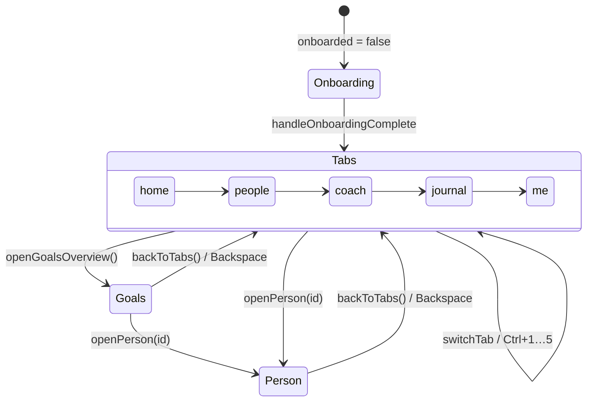
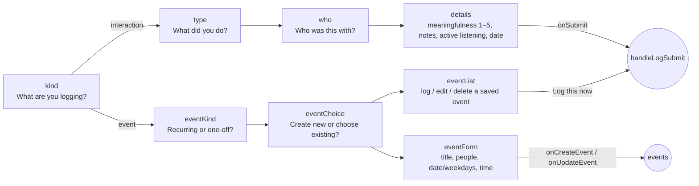

# Renderer structure (`src/App.jsx`)

Everything in the renderer except the React mount (`src/main.jsx`) lives in
[`src/App.jsx`](../../src/App.jsx). The file is divided by `/* ===== NAME ===== */` banners,
and that order is the dependency order: tokens → data → helpers → CSS → atoms → screens →
modals → the root component.

Line-numbered tables of every section, component (with props and "rendered by"),
function and constant are in [../generated/code-map.md](../generated/code-map.md).

## File layout by section

| Section banner | What lives there |
|---|---|
| **DESIGN TOKENS** | `THEME_LIGHT` / `THEME_DARK` palettes, `COLORS` (CSS-variable references), `LAYERS` (the 4 relationship layers), the six relationship dimensions (`DIM_*`), `makePerson`, info `CATEGORIES`, keyboard `SHORTCUTS` + `ShortcutsModal`, emoji lists, `NOTE_TEMPLATES` (quick-detail library), goal `PRESETS` + `PRESET_VARIANTS`, interaction `TYPE_META`, active-listening `AL_ITEMS`, `CONV_STATES`, `ACHIEVEMENTS` |
| **HELPERS** | `clamp`, `uid`, relative/absolute date helpers (`parseDaysAgo`, `dateToRelativeLabel`, `formatAbsoluteDate`, `toISODate`), chart-history helpers (`sortHistory`, `pushHistoryPoint`), `DateDropdown`, `TimeDropdown`, text builders (`summaryFor`, `updateStatusText`, `homeGoalTitle`, `generateSuggestions`) |
| **MOCK SCREENSHOT-ANALYSIS SCENARIOS** | `SCENARIOS`: canned transcripts and gradings used by the Coach "Analyse" tab. There is no real image analysis. |
| **SEED DATA** | Example people, goals, journal entries and skills (`INITIAL_*`), `EMPTY_SKILLS`, onboarding `FOCUS_OPTIONS` |
| **LOCAL PERSISTENCE** | `STORAGE_KEY`, `loadSaved`, `persistState`, daily check-in notification bookkeeping, `getCheckInSuggestions` |
| **CSS** | The `CSS` template string injected by ``: theme variables, phone frame, sheet layer, nav, FAB, toasts, animations. See [ui-system.md](ui-system.md). |
| **UI ATOMS** | `CircularProgress`, `ProgressBar`, `LabeledBar`, `Avatar`, `LayerBadge`, `ChatBubble`, `Timeline`, `ConvStateBadge` |
| **GOAL ROW / INFO ROW / NAV / SHEET** | `GoalRow`, `InfoItemRow`, `BottomNav`, and the overlay plumbing: `SheetLayerContext`, `SheetPortal`, `Sheet` |
| **HOME** · **PEOPLE** · **PERSON PROFILE** · **GOALS OVERVIEW** · **JOURNAL** · **CONVERSATION COACH** · **ME / SOCIAL SKILLS** · **ONBOARDING** | One section per screen (below) |
| **MODALS** | `ConfirmDialog`, `EditPersonModal`, `LogInteractionModal`, `GoalModal`, `TemplatePickerModal`, `QuickAddInterestModal`, `AddInfoModal`, `AddPersonModal` |
| **APP** | `LayersApp`: all state, every mutation handler, keyboard shortcuts, Electron bridge wiring, and the top-level layout |

At the bottom, a named `export { … }` exposes pure helpers for `src/logic.test.js`.

## Navigation model

There is no router. Two pieces of `LayersApp` state choose what's on screen:

- `activeTab`: `'home' | 'people' | 'coach' | 'journal' | 'me'` (`switchTab`, `BottomNav`, Ctrl+1–5)
- `screen`: `{ name: 'tabs' }` · `{ name: 'person', personId }` · `{ name: 'goals' }`
- `openCoach(personId, tab)` switches to the Coach tab, pre-selecting a person and a sub-tab (`'prepare' | 'analyse'`) through `coachInit`.
- The FAB (+) and bottom nav only render when `screen.name === 'tabs'`.

## Screens

| Screen | Component | What it shows / does |
|---|---|---|
| Onboarding | `OnboardingView` | Name, focus (`FOCUS_OPTIONS`), then either "start fresh" (add your own people) or "explore with example people" (seed data) |
| Home | `HomeView` | Greeting + weekly stats, *Prepare to talk* / *Analyse a conversation* shortcuts, **Current goals**, **Upcoming** (saved events due soon, with inline "log it now"), **Haven't caught up in a while**, **Recent activity** |
| People | `PeopleView` | "Your circle": searchable list (`#people-search-input`, `/` focuses it) grouped by layer, add person |
| Person profile | `PersonProfile` | Layer badge + layer-progress ring (level-up pulse), six dimension bars with **Adjust manually** sliders, *Prepare to talk* tips (`PrepareTipsModal`), **Ideas for next time**, **Goals** (`GoalRow`), **What I know about…** (five info categories via `InfoItemRow`, quick-add interests, temporary/archived items), relationship **Timeline**, **Progress** chart |
| Goals overview | `GoalsView` | Every goal across people plus general (skill) goals, with filters |
| Journal | `JournalView` | Searchable feed of logged interactions (`#journal-search-input`) |
| Coach | `CoachView` | **Prepare** tab: conversation hooks built from what you know (`buildPotentialHooks`) and suggestions. **Analyse** tab: pick one of the mock `SCENARIOS` → fake loading → grading, conversation state, info to approve into a profile (`onApproveInfo`), log the result (`onLogFromAnalysis`). |
| Me | `MeView` | "Your social skills" bars + **Progress history** chart, **Achievements**, **Appearance** (light/dark), Electron-only rows (version, check for updates / restart to install, launch at login, keyboard shortcuts), data export/import, restore sample data, delete everything |

## Modals and sheets

Every modal is a `Sheet` (or `ConfirmDialog`). Most are opened by a boolean flag on
`LayersApp`. A few are owned locally by the component that needs them.

| Modal | Opened by | Owner |
|---|---|---|
| `LogInteractionModal` | FAB, `N`, `openLog(personId)`, Home "manage events" / edit event | `LayersApp` (`logOpen`, `logInitialStep`, `logEditEvent`) |
| `GoalModal` | "Add goal" / goal "Edit" (`openGoalCreate`, `openGoalEdit`) | `LayersApp` (`goalModalOpen`, `goalEditing`) |
| `AddInfoModal` | "+" on an info category (`openAddInfo`) | `LayersApp` |
| `QuickAddInterestModal` | "Quick add" interests (`openQuickAddInterest`) | `LayersApp` |
| `AddPersonModal` | People "add", Ctrl+Shift+A | `LayersApp` |
| `EditPersonModal` | Profile "Edit" | `LayersApp` |
| `ShortcutsModal` | `?`, Me tab | `LayersApp` |
| `TemplatePickerModal` (standalone) | `D` outside logging. A pick copies the text to the clipboard. | `LayersApp` |
| `ConfirmDialog` | `askConfirm({...})` from any destructive handler | `LayersApp` (`confirmState`) |
| `TemplatePickerModal` (in-flow) | "+ Add detail" while logging / on Home upcoming | local state |
| `DateDropdown` / `TimeDropdown` pickers | The date/time buttons inside forms | local state, nested on top of the parent sheet |
| Goal variant picker | The `>` chevron on a selected preset in `GoalModal` | local `variantPickerFor`, nested |
| `PrepareTipsModal` | Profile "Prepare to talk" | local state in `PersonProfile` |

### `LogInteractionModal` steps

The modal is a step machine (`step` state). Titles come from its `titles` object:

`initialStep` lets callers jump straight to `eventKind` (manage events) or `eventForm`
(edit an event).

## Keyboard shortcuts

These are defined once in `SHORTCUTS` (shown by `ShortcutsModal`) and implemented in the
`keydown` effect in `LayersApp`. They're disabled while typing in an input or textarea and
before onboarding. `Esc` closes the top-most open modal in a fixed priority order. Inside
the log modal's *details* step, `D` opens the detail picker. That is a separate listener
in `LogInteractionModal`. The OS-wide **Ctrl+Shift+L** is registered by Electron, not here.
