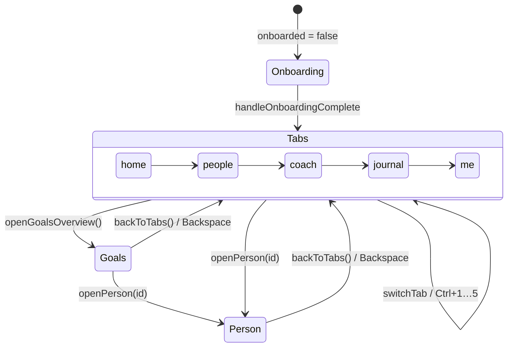
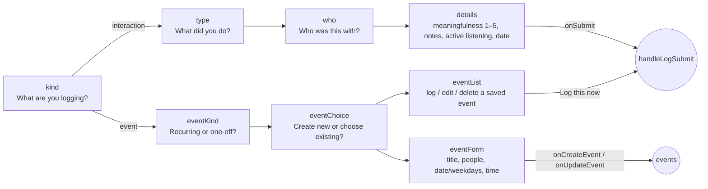

# Renderer structure (`src/`)

The renderer is split by role. Imports only point down the list below, so there are no
circular imports:

```text
src/main.jsx                  mounts <LayersApp/>
src/App.jsx                   LayersApp: all state, handlers, keyboard shortcuts, Electron wiring, layout
src/theme.js                  design tokens (THEME_*, COLORS) and the global CSS string
src/data/                     static data: no React, no logic
src/lib/                      pure logic: no React (except hooks.js), unit-tested
src/components/               shared UI pieces
src/modals/                   one file per sheet/dialog
src/views/                    one file per screen
```

Line-numbered tables of every file, component (with props and "rendered by"), function
and constant are in [../generated/code-map.md](../generated/code-map.md).

## File layout

| File | What lives there |
|---|---|
| [`theme.js`](../../src/theme.js) | `THEME_LIGHT` / `THEME_DARK` palettes, `COLORS` (CSS-variable references), and the `CSS` string injected by `<style>{CSS}</style>`: theme variables, phone frame, sheet layer, nav, FAB, toasts, animations. See [ui-system.md](ui-system.md). |
| [`fonts.js`](../../src/fonts.js) | The bundled Fraunces and Manrope `@font-face` rules (`FONT_FACES`), used at the top of `CSS` |
| [`data/constants.js`](../../src/data/constants.js) | `LAYERS` (the 4 relationship layers), the six dimensions (`DIM_*`) and new people's starting values (`LAYER_BASE_DIMS`), info `CATEGORIES`, keyboard `SHORTCUTS`, emoji lists, `NOTE_TEMPLATES` (quick-detail library) and where a logged topic is saved (`NOTE_TEMPLATE_CATEGORY`), goal `PRESETS` + `PRESET_VARIANTS`, interaction `TYPE_META`, active-listening `AL_ITEMS`, `CONV_STATES`, `ACHIEVEMENTS`, onboarding `FOCUS_OPTIONS`, skills order and the Me tab's per-skill tips (`SKILL_TIPS`) |
| [`data/seed.js`](../../src/data/seed.js) | Example people, goals, journal and skills (`INITIAL_*`), `EMPTY_SKILLS`. Each sample person sits exactly where Adjust would place them. |
| [`data/scenarios.js`](../../src/data/scenarios.js) | `SCENARIOS`: canned transcripts and gradings for the Coach "Analyse" tab. There is no real image analysis. |
| [`lib/util.js`](../../src/lib/util.js) | `clamp`, `uid` |
| [`lib/dates.js`](../../src/lib/dates.js) | Every date helper: relative/absolute labels, chart history (`sortHistory`, `pushHistoryPoint`), the stored-`at` helpers for journal entries, info items and timeline steps, date ordering (`newestFirst`, `sortByDay`), and the `backfill*` loaders. See [state-and-data.md](state-and-data.md#dates-store-the-day-derive-the-label). |
| [`lib/progress.js`](../../src/lib/progress.js) | The progression model: `computeOverall`, `layerForOverall`, `advanceLayer`, `placeOnLayers`, `progressDelta`, `dimsEqual`, `chartDay`, `movePerson`, `makePerson`, `bumpSkills`, `generateGoalDescription`. See [state-and-data.md](state-and-data.md#progression-model). |
| [`lib/text.js`](../../src/lib/text.js) | Sentence builders: `summaryFor`, `homeGoalTitle`, `generateSuggestions`, `getCheckInSuggestions`, `buildPotentialHooks`, `updateStatusText` |
| [`lib/storage.js`](../../src/lib/storage.js) | `loadSavedState` (checks saved data at startup) / `persistState` (the `layers-app-state-v1` key) and the last-notified-day bookkeeping. See [state-and-data.md](state-and-data.md#loading-saved-data). |
| [`lib/backup.js`](../../src/lib/backup.js) | `createBackup` / `validateBackup` for Export and Import. See [state-and-data.md](state-and-data.md#backup-format). |
| [`lib/hooks.js`](../../src/lib/hooks.js) | `useToday` (the local date, updated at midnight) and `useDailyCheckIn` (the once-a-day reminder). The only React in `lib/`. |
| [`components/`](../../src/components/) | `Sheet` + `SheetPortal`, `sheetLayer.js` (the portal context and the open-sheet stack Esc uses), `ErrorBoundary` (the "This screen hit a problem" fallback around the current screen), `atoms.jsx` (`CircularProgress`, `ProgressBar`, `LabeledBar`, `Avatar`, `LayerBadge`, `ChatBubble`, `Timeline`, `ConvStateBadge`), `rows.jsx` (`GoalRow`, `InfoItemRow`), `BottomNav`, `pickers.jsx` (`DateDropdown`, `TimeDropdown`) |
| [`modals/`](../../src/modals/) | `ConfirmDialog`, `EditPersonModal`, `LogInteractionModal`, `GoalModal`, `TemplatePickerModal`, `QuickAddInterestModal`, `AddInfoModal`, `AddPersonModal`, `ShortcutsModal` |
| [`views/`](../../src/views/) | `HomeView`, `PeopleView`, `PersonProfile` (with `AdjustSlider`, `PrepareTipsModal`), `GoalsView`, `JournalView`, `CoachView`, `MeView`, `OnboardingView` |
| [`App.jsx`](../../src/App.jsx) | `LayersApp`, plus three small helpers it uses: `sampleData`, `unlinkMissingPeople` and `addNotes` |

Where new code goes: anything without React goes in `lib/` (and gets a unit test in
`src/*.test.js`); a new screen gets its own file in `views/`, a new sheet one in
`modals/`. Behaviour you can see gets an app test in `tests/app/`; see
[testing.md](../testing.md). Component files export only components. React Fast Refresh
needs that, and it's why `SheetLayerContext` and the open-sheet stack live in their own
`sheetLayer.js`.

## Navigation model

There is no router. Two pieces of `LayersApp` state choose what's on screen:



- `activeTab`: `'home' | 'people' | 'coach' | 'journal' | 'me'` (`switchTab`, `BottomNav`, Ctrl+1–5)
- `screen`: `{ name: 'tabs' }` · `{ name: 'person', personId }` · `{ name: 'goals' }`
- `openCoach(personId, tab)` switches to the Coach tab, pre-selecting a person and a sub-tab (`'prepare' | 'analyse'`) through `coachInit`.
- The FAB (+) and bottom nav only render when `screen.name === 'tabs'`.

## Screens

| Screen | Component | What it shows / does |
|---|---|---|
| Onboarding | `OnboardingView` | Name, focus (`FOCUS_OPTIONS`), then either "start fresh" (add your own people) or "explore with example people" (seed data) |
| Home | `HomeView` | Greeting + weekly stats, *Prepare to talk* / *Analyse a conversation* shortcuts, **Current goals**, **Upcoming** (reminders due in the next 7 days, with inline "log it now"; always shown, so **+ New** is there before the first reminder), **Haven't caught up in a while**, **Recent activity** (newest logged day first) |
| People | `PeopleView` | "Your circle": searchable list (`#people-search-input`, `/` focuses it) grouped by layer, add person |
| Person profile | `PersonProfile` | Layer badge + layer-progress ring (level-up pulse), the last change and why, six dimension bars with **Adjust manually** sliders (previewing where saving would put them), *Prepare to talk* tips (`PrepareTipsModal`), **Ideas for next time**, **Goals** (`GoalRow`), **What I know about…** (five info categories via `InfoItemRow`, quick-add interests, temporary/archived items), relationship **Timeline**, **Progress** chart |
| Goals overview | `GoalsView` | Every goal across people plus general (skill) goals, with filters |
| Journal | `JournalView` | Searchable feed of logged interactions (`#journal-search-input`) |
| Coach | `CoachView` | **Prepare** tab: conversation hooks built from what you know (`buildPotentialHooks`) and suggestions. **Analyse** tab: pick one of the mock `SCENARIOS` → fake loading → grading, conversation state, info to approve into a profile (`onApproveInfo`), log the result (`onLogFromAnalysis`). |
| Me | `MeView` | "Your social skills" bars, your strength and focus (highest and lowest skill, with a tip and challenge from `SKILL_TIPS`; a "Getting started" note while every skill is 0%) + **Progress history** chart, **Achievements**, **Appearance** (light/dark), Electron-only rows (version, check for updates / restart to install / open download page for the portable build, launch at login, a warning if another app owns Ctrl+Shift+L, keyboard shortcuts), data export/import, restore sample data, delete everything |

## Modals and sheets

Every modal is a `Sheet` (or `ConfirmDialog`). Most are opened by a boolean flag on
`LayersApp`. A few are owned locally by the component that needs them.

| Modal | Opened by | Owner |
|---|---|---|
| `LogInteractionModal` | FAB, `N`, `openLog(personId)`, Home "manage events" / edit event | `LayersApp` (`logOpen`, `logInitialStep`, `logEditEvent`) |
| `GoalModal` | "Add goal" / goal "Edit" (`openGoalCreate`, `openGoalEdit`) | `LayersApp` (`goalModalOpen`, `goalEditing`) |
| `AddInfoModal` | "+" on an info category (`openAddInfo`) | `LayersApp` |
| `QuickAddInterestModal` | "Quick add" interests (`openQuickAddInterest`) | `LayersApp` |
| `AddPersonModal` | People "add", Ctrl+Shift+A | `LayersApp` |
| `EditPersonModal` | Profile "Edit" | `LayersApp` |
| `ShortcutsModal` | `?`, Me tab | `LayersApp` |
| `TemplatePickerModal` (standalone) | `D` outside logging. A pick copies the text to the clipboard. | `LayersApp` |
| `ConfirmDialog` | `askConfirm({...})` from any destructive handler | `LayersApp` (`confirmState`) |
| `TemplatePickerModal` (in-flow) | "+ Add detail" while logging / on Home upcoming | local state |
| `DateDropdown` / `TimeDropdown` pickers | The date/time buttons inside forms | local state, nested on top of the parent sheet |
| Goal variant picker | The `>` chevron on a selected preset in `GoalModal` | local `variantPickerFor`, nested |
| `PrepareTipsModal` | Profile "Prepare to talk" | local state in `PersonProfile` |

### `LogInteractionModal` steps

The modal is a step machine (`step` state). Titles come from its `titles` object:



`initialStep` lets callers jump straight to `eventKind` (manage events) or `eventForm`
(edit an event). With nobody in your circle the modal still opens: *Interaction* is
disabled and says to add someone first, and events can be made without people.

## Keyboard shortcuts

These are defined once in `SHORTCUTS` (shown by `ShortcutsModal`) and implemented in the
`keydown` effect in `LayersApp`.

- **When they're off (all but `Esc`):** while typing in a text field (a focused slider or
  checkbox doesn't count), before onboarding, and while any sheet or dialog is open.
- **Modifiers:** single-key shortcuts (`N`, `D`, `/`, `?`, Backspace) ignore Ctrl, Alt and
  Win combinations, so Ctrl+N or Alt+D don't open anything. Ctrl+1–5 and Ctrl+Shift+A
  don't fire with Alt held.
- **`/`** switches to People (or stays on Journal), then focuses that tab's search box once
  it has rendered, through the `searchFocus` state. It works from any tab.
- **`Esc`** leaves a search box, or closes only the top-most sheet or dialog. See
  [ui-system.md](ui-system.md#esc-and-the-open-sheet-stack).

Inside the log modal's *details* step, `D` opens the detail picker. That is a separate
listener in `LogInteractionModal`, and it also ignores Ctrl, Alt and Win. The OS-wide
**Ctrl+Shift+L** is registered by Electron, not here.
