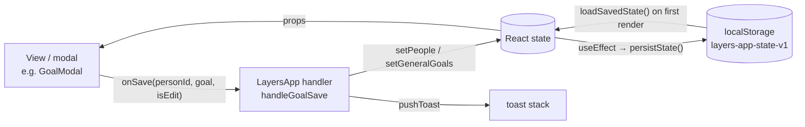

# State, data model & persistence

## Where state lives

All app state is `useState` in `LayersApp` ([`src/App.jsx`](../../src/App.jsx)). Screens receive slices as
props, and they receive mutations as `on*` callbacks that point at `handle*` functions
in `LayersApp`. Child components never call a setter for shared data directly.



### Persisted state

These keys are saved as one JSON blob under `localStorage['layers-app-state-v1']` by
`persistState()` whenever any of them changes:

| Key | Type | Initial value (no save) |
|---|---|---|
| `people` | `Person[]` | `INITIAL_PEOPLE` (5 example people) |
| `journal` | `JournalEntry[]` | `INITIAL_JOURNAL` |
| `generalGoals` | `Goal[]` (`personId: null`) | `INITIAL_GENERAL_GOALS` |
| `events` | `Event[]` | `[]` |
| `skills` | `Skills` | `INITIAL_SKILLS` |
| `profile` | `Profile` | `{ name: '', focus: null }` |
| `onboarded` | `boolean` | `false` |
| `themeMode` | `'system' \| 'light' \| 'dark'` | `'system'`: Match Windows. Saves from before 2026-10-05 have none, so they follow Windows too (the owner's choice). |
| `theme` | `'light' \| 'dark'`: what's showing, worked out from `themeMode` | `'light'` |
| `achievements` | `{ [key]: 'YYYY-MM-DD' }`, or `null` until worked out | `null` (saved as `{}`). See [Achievements](#achievements). |
| `deleted` | `{ id, kind: 'person'\|'entry'\|'event'\|'goal', at }[]`: what was deleted in the last 90 days | `[]`. Saved only; see [Ready for syncing](#ready-for-syncing). |

`layers-calendars` holds your other calendars' events as last fetched (`{ fetchedAt, items,
errors }`), so Today shows them offline; like `layers-sync`, it's this computer's only:
not synced, not in backups ([Other calendars](#other-calendars-read-only)).

`layers-sync` holds this computer's sync settings (`{ on, lastSynced, error }`), which
aren't synced themselves ([Syncing through OneDrive](#syncing-through-onedrive)).

Three more keys belong to notifications ([below](#notifications)):
- `layers-last-notified-date`: the day the check-in nudge last fired
- `layers-notified-reminders`: notifications Layers already showed itself, in a browser
- `layers-snoozes`: snoozed reminders

`useToday` ([`src/lib/hooks.js`](../../src/lib/hooks.js)) holds the local date. It
notices a new day within a minute of midnight, or as soon as the window becomes visible
again. `LayersApp` passes `today` to `TodayView`, `PersonProfile` and `JournalView`, whose
cached date maths (the day plan, ideas, profile suggestions,
goal due labels, the journal's period filters) runs from it, so it refreshes at midnight
even when the app has been in the tray for days.

### Loading saved data

`loadSavedState()` in [`lib/storage.js`](../../src/lib/storage.js) runs once, on the
first render. It checks the saved state with `validateBackup`, the same check an import
gets ([below](#backup-format)). It passes `source: 'saved'`, which only changes the
wording of the warnings ("for people who are no longer in your circle" instead of "not in
the backup"). It returns `{ state, problem }`:

| Saved data | Result |
|---|---|
| None, or storage disabled | `state: null`, so the initial values above and onboarding |
| Valid | Loaded as it is, then dated by the `backfill*` helpers |
| Some records damaged | Repaired or skipped as for an import. `problem.kind` is `'repaired'`, and an OK-only notice lists what was skipped. |
| Not JSON, not an object, or refused by `validateBackup` | `state: null` and `problem.kind: 'unreadable'`. Layers starts fresh, and a notice explains and suggests importing a backup. |

In both problem cases the original text is first copied to
`localStorage['layers-app-state-v1-unreadable-<ISO time>']` (`UNREADABLE_PREFIX`), so the
next save can't destroy it. The same text is only copied once. If storage is full the copy
can't be kept, and the notice says so (`copyKept`). Before 1.0.27, unreadable data was
silently replaced by the sample people, and the next save overwrote it for good.

`persistState` returns `false` when a write fails (storage full or disabled). The persist
effect in `LayersApp` then shows one toast suggesting a backup export. It stays quiet
for later failures until a save has worked again (the `saveFailed` ref).

### UI-only state (not persisted)

`screen`, `activeTab`, `coachInit`, `searchFocus` (which search box `/` should focus once
its tab renders), toasts, every modal-open flag and its target (`goalEditing`,
`addInfoTarget`, `editingEntryId`, …), `confirmState`, updater status, auto-launch flag,
shortcut status, app version, and `sheetLayer` (the DOM node sheets portal into).

## Data model

These shapes are inferred from the seed data and handlers. There are no runtime types.

```ts
type Person = {
  id: string; name: string; emoji: string;    // the emoji, with any skin tone in it
  avatar?: { style: 'initials'; color: string } // their initials instead (INITIAL_COLORS key; 'layer' follows their layer), the default for new people
         | { style: 'photo'; src: string };     // or a photo: a 160 px JPEG data URL (under 300 KB of text). cleanAvatar keeps only these two
  layer: 1 | 2 | 3 | 4;                       // see LAYERS
  overall: number;                            // 0–100 progress *within the current layer*
  dims: Record<'depth'|'trust'|'reciprocity'|'interaction'|'sharedExperiences'|'listening', number>; // each 0–100
  interests: InfoItem[]; preferences: InfoItem[]; plans: InfoItem[];
  experiences: InfoItem[]; important: InfoItem[]; // the five CATEGORIES
  goals: Goal[];
  history: HistoryPoint[];                    // layer-progress chart
  timeline: TimelineStep[];
  justLeveledUp?: boolean;                    // drives the level-up pulse; cleared by onClearLevelUpFlag
  lastChange?: {                              // the profile's change card; written by movePerson
    before: number; after: number;            // `overall` before and after
    beforeLayer?: number; afterLayer?: number; // since 1.0.27; older records mean "the current layer"
    why: string[];
  };
};

type InfoItem = {
  id: string; emoji: string; text: string;
  at: string;                                 // 'YYYY-MM-DD': the day it was last mentioned or edited ("Last mentioned" is derived from it)
  updated?: string;                           // legacy label ('Today', '9 days ago'), only until backfilled
  temporary: boolean; archived: boolean;
};

type TimelineStep = {
  label: string;                              // 'First met', 'Reached Layer 3: …', 'Moved to Layer 2: …', …
  at: string;                                 // 'YYYY-MM-DD'
  date?: string;                              // legacy label ('2 months ago'), only until backfilled
};

type Goal = {
  id: string; personId: string | null;        // null = general/skill goal (generalGoals)
  category: 'relationship' | 'skill' | 'custom';
  type: string;                               // PRESETS key, or 'custom'
  title: string; description: string;
  dueDate?: string | null;                    // 'YYYY-MM-DD'
  progress: number;                           // 0–100; 100 = completed
  history: HistoryPoint[];
};

type HistoryPoint = {
  date: string;                               // "Sep 12" display label
  at?: string;                                // 'YYYY-MM-DD' sort key
  value: number;
  layer?: number;                             // person history only: the layer `value` is a percentage of (since 1.0.27)
};

type JournalEntry = {
  id: string; personId: string;
  at: string;                                 // 'YYYY-MM-DD': the day it happened (the picked date). Labels are derived from it.
  date?: string;                              // legacy label ('Today', 'Aug 31'), only until backfilled; see below
  type: 'talked'|'activity'|'messaged'|'hangout'|'called'|'other'|'analysed'; // TYPE_META
  meaningfulness: 1|2|3|4|5;
  added: string[];                            // note texts saved to the profile
  activeListening: string[];                  // AL_ITEMS keys
  summary?: string;                           // the note
  reflection?: string;                        // "How did it feel?" (the log's More details, or Edit entry)
  ratings?: { [dimension]: 1|2|3|4|5 };       // "How did each part go?" (More details); only rated dimensions
  goalIds?: string[];                         // the goals this log moved (logs from 2026-10-06 on); the Journal's goal filter
  standouts?: string[];                       // older 1.0.28 builds' "What stood out?" picks; shown, no longer written
  analysis?: { grading: object; conversationState: string }; // from Coach → Analyse
};

type Event = {                                // a plan on the calendar; see The calendar
  id: string; title: string; personIds: string[];
  kind: 'oneoff' | 'recurring';
  date?: string;                              // 'YYYY-MM-DD' (one-off)
  weekdays?: number[];                        // 0=Sun…6=Sat (recurring; all seven = daily); legacy single `weekday` also read
  from?: string;                              // recurring: the first day it applies (1.0.30+; older ones have always applied)
  skipDays?: string[];                        // recurring: days it doesn't come up on, because that day alone was changed (now a one-off) or deleted
  time?: number | null;                       // minutes since midnight; null for all day
  allDay?: boolean;
  duration?: number;                          // minutes; missing means 60
  alert?: number | null;                      // minutes before to notify; null = none; missing means 0 (at the time, as before 1.0.30)
  template?: string;                          // EVENT_TEMPLATES key: the emoji, and the type a log of it gets
  updatedAt?: string;                         // ISO timestamp of the last change (for syncing later)
  defaultMeaningfulness?: number;
  goalId?: string;                            // one of its people's goals; logging the reminder moves only that goal
  doneAt?: string;                            // one-off: the day it was marked done. It's finished for good.
  doneDays?: string[];                        // recurring: recent days marked done or skipped (last 14; older saves have one doneOn)
  missedDays?: string[];                      // days it didn't happen (last 14): nothing logged, not done, not asked about again
  createdAt: string;                          // 'YYYY-MM-DD' ('Today' before 1.0.27)
};

type Profile = {
  name: string;
  focus: string | null;                       // FOCUS_OPTIONS key: 'new' | 'deepen' | 'skills' | 'mix'
  reminderNotifications?: boolean;            // Me → Notifications; missing means on (all of these: NOTIFY_DEFAULTS)
  defaultAlert?: number | null;               // the reminder new plans start with (15)
  morningSummary?: boolean; morningTime?: number;   // on, 8:00 AM (minutes since midnight)
  eveningHeadsUp?: boolean; eveningTime?: number;   // on, 8:00 PM
  askAfter?: boolean;                         // "How did it go?" when a plan with people ends; on
  checkInNotifications?: boolean;             // Me → Notifications; missing means on
  tried?: { jump?: true; quick?: true };      // Ctrl+K and the quick-add box used at least once (Today's getting-started list)
  gettingStartedHidden?: boolean;             // Hide on that list; cleared when you set up again
};

type KeyDate = {                              // Person.dates: birthdays and other days for the calendar
  id: string; kind: 'birthday' | 'anniversary' | 'exam' | 'bigday' | 'custom';
  date: string;                               // 'YYYY-MM-DD'; a yearly one matches month and day every year
  yearly: boolean;
  label?: string;                             // custom ones' own wording
};

type Skills = Record<'activeListening'|'followUp'|'reciprocity'|'selfDisclosure'|'readingCues'|'knowingWhenToStop',
  { label: string; current: number; history: HistoryPoint[] }>;
```

### Dates: store the day, derive the label

Every date in the data is an absolute ISO day. Nothing stores a relative label like
`'Today'` any more, because a stored label never ages.

- **Journal entries, info items and timeline steps** keep their day in `at`. The shared
  helpers `storedDay` / `storedDaysAgo` / `storedDateLabel` turn it into an age or a
  "3 days ago" label on every render, so labels age on their own. Each record type has a
  thin wrapper:
  - journal: `journalDateLabel`, `journalDaysAgo`, and `isJournalThisWeek` (the last 7
    days, rolling, not the calendar week). Used by the Journal, Me ("being developed"), the calendar's ideas, the Coach's "Last time you spoke" hook and
    `getCheckInSuggestions`.
  - info items: `infoItemDateLabel` ("Last mentioned: …" on the profile) and
    `infoItemDaysAgo` (the 3- and 7-day thresholds in `generateSuggestions`, which feeds
    "Ideas for next time").
  - timeline: `timelineDateLabel`. **The timeline always shows the calendar date**
    (`'Sep 26'`, or `'Aug 4, 2025'` for another year) and never a relative label, because
    it's a record of when things happened. Steps are shown in date order (`sortByDay`),
    so a step added for a backdated log lands where it belongs. The "Current: Layer N,
    <name>" step is added at render time with `at: today` and the prefix "As of ".

  When you write one of these records, set `at: toISODate(day)`. A logged note uses the
  interaction's picked date, and adding or editing an item uses today. Never store a
  derived label.
- **Chart history points** carry a display label plus an ISO `at` key. `sortHistory`
  sorts and de-duplicates points by day, so logging twice on one day updates that day's
  point. A backdated log never adds a point in the past (`chartDay`, see
  [Charts and the timeline](#charts-and-the-timeline)).
- **Events** store ISO dates because they can be in the future.

#### Records saved before `at` existed

Older data, and the seed `INITIAL_JOURNAL` / `INITIAL_PEOPLE`, only has labels: journal
`date` (plus a stale `isThisWeek` flag), info-item `updated` and timeline `date`.
`backfillJournalDates` and `backfillPeopleDates` give each record an `at` when data is
loaded from `localStorage`, when a backup is imported, and when the sample people are
loaded (onboarding, or Me → "Add sample people").
Both use the same `backfillDated` routine. It removes the legacy label once `at` is set,
and it skips records that already have an `at`, so each record is dated once and then
never moves.

- **Absolute labels** (`'Aug 31'`, `'Aug 20, 2025'`) are parsed exactly by
  `parseAbsoluteLabel`. A label without a year means its most recent past occurrence.
- **Relative labels are ambiguous.** `'Today'` meant the day the entry was logged, and
  that day was never stored. They're read as of an *anchor* instead. For saved data the
  anchor is the first launch after the upgrade. For an import it's the backup's
  `exportedAt` (no label in a backup can be newer than the export), falling back to now if
  `exportedAt` is missing or invalid. The real log date can't be later than the anchor, so
  a backfilled date is never *earlier* than the real one. A person last logged as
  "Today" weeks ago therefore starts aging from the anchor, rather than being flagged as
  overdue immediately. `'N months ago'` stays approximate (30-day months).
- **Unreadable labels** are left alone. The record shows its label text as-is and counts
  as long ago (999 days), which is what `parseDaysAgo` did before.

Skill history in the sample data uses bare month labels (`'Sep'` … `'Jan'`), which can't
be sorted against new points. `backfillSkillDates` gives each one the 1st of its month,
walking back from the newest point so the months stay in order across a year boundary
(`'Jan'` is this January, `'Dec'` the one before). It runs at the same three moments.

## Progression model

The helpers are in [`lib/progress.js`](../../src/lib/progress.js) and unit-tested in
`src/progress.test.js`.

**Logging an interaction** (`handleLogSubmit`). The log sheet always sends the people,
type, meaningfulness, profile notes, active-listening ticks, the note (`summary`) and the
picked date. Its optional **More details** section can add three more inputs:

- `ratings`: "How did each part go?", a 1–5 rating for any of the six dimensions
  (`DIM_QUESTIONS` holds the questions). With More details open, typing a number rates
  the highlighted row and moves down; Backspace steps back and clears; the arrows move.
- `goalIds`: the goals left ticked under "Goals this moved". `undefined` means every
  active goal of each person in the log, and the sheet sends `undefined` unless you
  untick one. A logged reminder that's linked to a goal sends just that goal.
- `reflection`: "How did it feel?", saved on the journal entry.

Then:

1. Each of the six dimensions gets a bump (`dimBumps` in
   [`lib/progress.js`](../../src/lib/progress.js)). A **rated** dimension grows by its
   rating: `round(rating × 2.2)`, so 1 → +2, 3 → +7, 5 → +11, plus the active-listening
   bonus for reciprocity and listening. An unrated one uses the original formula with
   meaningfulness, interaction type and active-listening ticks. The ratings are listed
   in the `why` ("You rated it: Depth 4, Trust 5"). Dimensions are clamped to 0–100.
2. **Layer progress (`overall`) only moves for meaningfulness ≥ 4.** The bump is
   `round(avg(dimension bumps) × 0.55)`.
3. `advanceLayer(layer, overall, bump)` treats each layer as its own 0–100 meter.
   Reaching 100 moves up a layer (max 4) and carries the overflow into the new layer.
   Every person's result is worked out in one pass, so a group log toasts every level-up.
   Then `keepDimsInLayer` keeps the dimensions inside the (new) layer's band
   ([below](#dimensions-stay-inside-the-layer)).
4. Every unfinished goal for that person gains `round(meaningfulness × 3.2)`, or only the
   goals in `goalIds` when it's given. An unticked goal stays where it is. A goal about
   one dimension (`GOAL_PRESET_DIM`: "Have deeper conversations" and depth, "Spend more
   time together" and shared experiences, ...) uses that dimension's rating instead when
   it was rated (`goalBumpFor`).
5. "+ Add detail" is what you did together (`ACTIVITY_TEMPLATES` in
   [`data/constants.js`](../../src/data/constants.js): food and drink, out and about,
   fun, sport, school and work, talking, online and phone, helping; talking and online
   first for a message or call). It goes in the log's note only, never on the profile.
   (Until 2026-10-07 it offered interest topics, `NOTE_TEMPLATES`, which were filed on
   the profile.) What you learned about someone is More details' "Something new about
   …?", saved into the category you picked (one-person logs only). A topic that's already saved
   (same text, ignoring case) gets its `at` refreshed and leaves the archive, rather than
   being added twice (`addNotes` in `App.jsx`).
6. A journal entry is prepended, with `ratings` and `reflection` when they're given.
   Global skills get small bumps (`bumpSkills`), and skill goals whose skill went up move
   with it ([below](#skill-goals-move-with-skills)).

**Other paths:**

- `handleLogFromAnalysis` follows the same pattern from a Coach scenario's grading.
  Progress only moves when the grading's overall score is ≥ 70. Goals gain exactly the
  `goalImpact` the review shows as "Goal progress: +N%". Coach remembers what was saved
  and logged for each person and sample, so the same analysis can't be logged twice.
- `handleAdjust` (manual sliders): see [Adjust](#adjust) below.
- `handleBumpGoal` ("Mark progress") adds +20 to a goal, and a toast celebrates reaching 100.
- `handleUpdateEntry` and `handleDeleteEntry` (the Journal's pencil, `EditEntryModal`)
  change the record, not progress. You can change an entry's date, type,
  meaningfulness, note and reflection, or delete it after a confirmation. What the entry
  already added to the person, their goals and your skills stays, because later progress
  may have been built on it, and the sheet says so. Editing removes a legacy `date` label
  so it can't contradict the new `at`. An analysis keeps its `analysed` type.

### Skill goals move with skills

Each "My skills" goal preset follows one skill. `SKILL_GOAL_PRESETS` in
[`data/constants.js`](../../src/data/constants.js) maps them: `followUpQ` → `followUp`,
`fewerQuestions` and `reciprocal` → `reciprocity`, `recognizeSpace` →
`knowingWhenToStop`, and so on. `handleLogSubmit` and `handleLogFromAnalysis` work out
the new skills first. `raisedSkills(before, after)` lists the skills that went up, and
`advanceSkillGoals(goals, raised)` adds `SKILL_GOAL_STEP` (+20) and a chart point to every
unfinished goal that follows one of them. It runs over the general goals and the goals
of the people in the log. Before 1.0.28 skill goals only moved with "Mark progress".

### Moving a person

Logging, Coach and Adjust all finish with
`movePerson(p, { layer, overall, at, why, extra })`. It sets the new layer and
percentage plus any `extra` fields (dimensions, goals, info items), and records:

- **`lastChange`** with `before`/`after` percentages, `beforeLayer`/`afterLayer` and the
  `why` list. The profile's change card names both layers when they differ and counts
  the gain through them with `progressDelta`, which treats each layer as 100%: Layer 2 at
  90% → Layer 3 at 4% is +14%, not "+0%".
- **A history point** with its `layer`, so People's trend arrows read a level-up
  (Layer 2 at 95% → Layer 3 at 5%) as a rise.
- **A dated timeline step** ("Reached Layer 3: …" or "Moved to Layer 2: …") whenever the
  layer changes.
- **`justLeveledUp`** when the layer goes up, for the profile's level-up pulse.

### Charts and the timeline

`chartDay(history, at)` picks the day for a new chart point. A point never lands before
the newest one already on the chart: a backdated log changes progress *now*, so it's
recorded on that newest day. It used to be written at the old date, where it replaced
that day's point and made the line jump up and back down. Person and goal history both
use it.

`bumpSkills(skills, bumps, at)` raises skills and records a chart point, at most one per
skill per day. Before 1.0.27 nothing added points, so the Me tab's skills chart stayed
empty for anyone who didn't start with the sample data.

### Adjust

`placeOnLayers(avg)` maps the dimension average onto the layers absolutely. Each layer
is a 25-point band (`layerForOverall`: <25 / <50 / <75 / ≥75), and the position inside
the band is that layer's 0–100% meter.

- **Saving with nothing changed does nothing.** `PersonProfile` just closes the panel,
  and `handleAdjust` also checks `dimsEqual` and toasts "No changes".
- **Adjust previews the result.** Once a slider moves, a line under the sliders says where
  saving would put the person, and highlights a layer change.
- Moving up a layer toasts 🎉; moving down toasts too.

### Where new people start

`makePerson` gives every dimension `LAYER_BASE_DIMS[layer]`: `{ 1: 5, 2: 30, 3: 55, 4: 80 }`,
which is 20% into each 25-point band. It then sets `overall` with `placeOnLayers`, so a
new person starts at 20% of their layer, exactly where Adjust would place them. The
sample people in [`data/seed.js`](../../src/data/seed.js) are set the same way, and
`src/progress.test.js` checks that they are.

**The closeness quiz** ([`lib/closeness.js`](../../src/lib/closeness.js)) places someone
you add, or add while setting up. It asks up to eleven questions, from "Would they say hi
if you passed each other in a corridor?" to "Could you sit in silence and it still feel
comfortable?", each Yes (1), Sort of (0.5) or No (0), and each belonging to a layer. A
layer is reached when its answers average 0.6 or more (more yes than sort of), and the
next layer's questions only come once it is, so it can stop after two. The placement is
the deepest layer reached, and how far into it: 40% of how sure that layer is plus 60%
of how much of the next one is there (for Layer 4, 10–90% by how sure it is), kept
between 5% and 90%. `makePerson({ …, overall })` then sets every dimension to
`(layer − 1) × 25 + overall / 4`, so Adjust would place them there too. Picking a
layer by hand instead (or skipping the questions) starts them at the usual 20%.

### Dimensions stay inside the layer

Adjust places people by their dimension average (25-point bands), but logging grows the
dimensions faster than layer progress, on purpose: a quick chat still credits the
dimensions, while only meaningful logs move the meter. They used to drift apart, so the
dimensions could describe a higher layer than the one shown, and Adjust would move the
person. P3, option C ([roadmap.md](../roadmap.md#p3-one-progress-model)) keeps them in
step:

- **`keepDimsInLayer(old, new, layer)`**, after every log and analysis. Growth that would
  push the average past the top of the layer's band is scaled down. The dimensions that
  grew most stay ahead, and none drops below where it was. A level-up lifts the
  dimensions to at least the bottom of the new band. `layerDimBounds` gives each band as
  a sum (Layer 3 is 297–446), because the average is rounded.
- **Saved data version 2.** `persistState` writes `dataVersion: 2`. A save without it gets
  `migrateDimsToLayers` once at startup (`loadSavedState`, which returns the
  `migrated` names), and so does an imported backup. Only people whose dimensions are
  outside their band move, scaled proportionally (`scaleDimsToSum`) to where their meter
  is, so Adjust then shows the layer and percentage they already have. Their layer and
  `overall` don't change. A one-time "Dimensions updated" notice names them.

Within a layer, Adjust can still change the percentage, since it places by the
dimensions. The preview shows both, for example "Saving puts Ana at Layer 3: Personal,
40% (now 72%)", before anything is saved.

## The calendar

Plans (`events`) are the calendar. [`lib/calendar.js`](../../src/lib/calendar.js) holds
its logic, as plain functions with no Electron or Windows in them, so it can move to a
phone later. It's unit-tested in `src/calendar.test.js`.

- **`occursOn(ev, day)`**: a one-off on its date; a repeating plan on its weekdays (all
  seven is daily), from its `from` day.
- **`dayAgenda(state, day)`**: one day's plan, as:
  - `allDay`: key dates, goals due and all-day plans
  - `timed`: plans with a time, in order, each with its start and end
  - `logged`: the journal entries for that day
- **`monthMarks`** gives the month grid's dots. Daily routines aren't counted, so special
  days stand out.
- **`needsAnswer`**: plans with people that have ended and aren't done (or marked as
  didn't happen), for **How did it go?** (**Log it**, **Just tick it** or **Didn't
  happen**).
- **`usualGap`** and **`quietDay`**: how long you usually go between logs with someone
  (the middle of the gaps between their last seven logged days), and the day they count as
  gone quiet: half as long again (7 to 60 days), or their layer's quiet days (below) until
  there are three logged days.
- **`weekSummary(state, day)`**: the Monday-to-Sunday week around `day` for the weekly
  review: who was seen, interactions logged, plans done of planned (not daily routines),
  goals with a history point that week, and next week's Monday and plans.
- **`readSentence(text, { people, today, now })`** ([`lib/sentence.js`](../../src/lib/sentence.js)):
  a typed plan or log, for Ctrl+K and the quick-add box. People by full or first name
  (closest first when two share one), after "with" or its short "w" (or "w/"), a template
  from its word (an activity or study word like "movie" or "revise" names the plan:
  "Movie with Sam") (coffee, call, dinner or
  lunch, hang out, study, check in, game or movie), days (today, tomorrow, a weekday,
  "next fri", "in 3 days", "12 oct", "12/10" day first; a date gone by this year means
  next year), times ("10am", "7:30pm", "19:00", "at 7" for 7 PM, noon, evening), how long
  ("2h", "half an hour") and repeats ("every mon wed", "weekdays", "mondays", "every
  day"). Other words stay in the title. Past-tense words ("talked", "called"), "log" or a
  day gone by make it a log, with a rating word (brief to deep) or 1–5. It returns what it
  understood with `unknown` names and `missing` ('when', 'who', 'rating');
  `planFieldsOf` turns a plan into PlanSheet's saved fields.
- **`jumpResults(query, …)`** ([`lib/jump.js`](../../src/lib/jump.js)): Ctrl+K's rows; see
  [app-structure.md](app-structure.md#ctrlk-jump-to-anything).
- **`planTips(ev, state, day)`** ([`lib/tips.js`](../../src/lib/tips.js)): Coach tips
  for a plan: `PLAN_TIPS` for its template, then for each person up to four of
  Prepare's hooks (`buildPotentialHooks`), their key dates from the plan's day to two
  weeks after (`datesAround`), `lighter` for Layers 1 and 2, and the goal it moves with
  its preset's suggestion. Only saved data and templates; nothing is made up.
- **`planIdeas`**: people it's been a while since you logged with, sooner the closer
  they are: 35 days for Layer 1, 21 for Layer 2, 14 for Layer 3, 7 for Layer 4. Only
  people with nothing planned in the next week.
- **`markDone(ev, day)`** (`lib/reminders.js`): a one-off gets `doneAt` and is finished
  for good; a repeating one adds the day to `doneDays` (the last 14). Logging a plan
  ticks it off for that day, and only its linked goal (`goalId`) moves. Done after all
  takes the day back out of `missedDays`.
- **`markMissed(ev, day)`**: it didn't happen. The day goes in `missedDays` (either
  kind of plan; the last 14), and `isMissedOn` keeps it apart from done: nothing is
  logged, it isn't counted as done, "How did it go?" stops asking, and it no longer
  clashes, gets reminders or counts as planned for ideas. Today and the day popup show it
  struck through with ✕ and "Didn't happen".
- **One day of a repeating plan**: editing it from one of its days with **Only <day>**
  saves that day as a one-off of its own (moved, retimed, renamed as you like) and adds the
  day to the repeat's `skipDays`, so it isn't there twice; deleting **Only <day>** just
  adds the day. `occursOn` leaves out skipped days, so the day plan, the month, Ctrl+K and
  notifications all follow.
- **`followUpEvent(person, item)`** makes a one-off like `Ask Sam how "Job interview"
  went` for three days later at 9:00 AM. It's the bell on a temporary detail in the
  profile.

### Notifications

`plannedNotifications(state, settings, from, to, snoozes)` lists every notification due
in a time window, oldest first. Each has a `tag` (unique per plan and day), a time,
`kind`, title, body, and the plan and day it's about:

| Kind | When | Says |
|---|---|---|
| `alert` | A plan's `alert` minutes before it (all-day: 9:00 AM) | The title; "In 15 minutes · 10:00 AM · with Priya" |
| `after` | When a plan with people ends, unless it's done (`askAfter`) | "How did it go with Priya?" |
| `morning` | `morningTime`, on days with something on | "Today: 3 things", and each in a line |
| `evening` | `eveningTime`, the night before a day with something on | "Tomorrow: …" |
| `snooze` | A snoozed reminder's time | The title, "Snoozed reminder" |
| `catchup` | `catchUpDay` (Saturday) at `morningTime`, when anyone's due a catch-up (`planIdeas`) | "Catch up this week: 3 people", "Priya (3 weeks) · …", with up to three people for Plan buttons |
| `quiet` | Noon on `quietDay()` for someone Personal or Close, unless something with them is planned or done in between | "It's been a while since you saw Priya": "11 days, longer than usual for you two" |
| `review` | Sundays at `reviewTime` (7:00 PM) | "Your week" |
| `date` | A person's key date: a week before and on the day (`morningTime`), and the evening before (`eveningTime`), unless `keyDateReminders` is off | "🎂 Priya's birthday is in a week", "🎂 Tomorrow: …", "🎂 Today: …" |

`useCalendarNotifications` in [`lib/hooks.js`](../../src/lib/hooks.js) delivers them:

- **In the Windows app** it hands the next 14 days to the main process
  (`layersSystem.scheduleNotifications`) whenever they change, and again every hour.
  Windows then shows them on time, even with Layers closed
  ([electron.md](../electron.md#notifications)).
  - A reminder (before a plan, or as it starts) only has snooze buttons (10 minutes,
    1 hour, Tomorrow). There's nothing to log or tick off until it has happened.
  - "How did it go?" has **Log it** and **Just tick it**.
  - Clicking a notification itself opens that day.
- **In a browser** it shows each one itself while Layers is open, within 15 minutes of its
  time, once (the tags are kept in `localStorage['layers-notified-reminders']`, the
  latest 200).

A button comes back as a `layers://` link (`parseActionUrl`), and `handleCalendarAction`
in `App.jsx` acts on it: it marks the plan done, snoozes it, opens the quick log filled in,
or shows the day. Snoozes (`{ id, eventId, day, at }`) live in
`localStorage['layers-snoozes']` until a day after they fire, not in the saved state or
backups.

The daily check-in nudge (`useDailyCheckIn`, `checkInNotifications`) still comes from the
page while Layers runs. Neither hook runs before onboarding.

## Achievements

`ACHIEVEMENTS` in [`data/constants.js`](../../src/data/constants.js) lists five.
[`lib/achievements.js`](../../src/lib/achievements.js) works out progress from your data:
`achievementProgress(people, journal, skills)` returns `{ done, have, need, unit }` for
each one, and `progressText` words it for a locked card ("2 of 5 conversations", "40% of
75%"). "Active Listener" counts conversations with at least one active-listening tick, as
its description says. It used to count ticks.

Once reached, an achievement is recorded in the `achievements` state with the day:
`{ firstMeaningful: '2026-10-04' }`. An effect in `LayersApp` calls
`newlyUnlocked(progress, achievements)` whenever people, the journal or skills change,
and records anything new. A recorded achievement stays unlocked even if the data changes
later, for example after you remove a person, and Me shows "Unlocked Oct 4". Up to
1.0.27 they were worked out on every render, so they could lock again.

`achievements` is saved with the rest of the state and goes into backups, where
`validateBackup` checks it ([below](#backup-format)). `null` means "not worked out yet":
saved data or a backup from before 1.0.28, or just after "Remove sample people" or
clearing skills and achievements when starting over. The effect then works them out from the data.

**Quiet recording.** Only achievements you reach by using the app get a toast ("🏅
Achievement unlocked: …"). Ones that loading data earns are recorded without one: at
startup, at onboarding, when the sample people are added or removed, and on import.
The `quietAchievements` ref starts `true` for startup, and those handlers set it again
before changing state. The effect reads it and clears it. It's also quiet while
`achievements` is `null` and before onboarding, so an upgrade doesn't announce everything
at once.

## Sample people

The five sample people (`INITIAL_PEOPLE` in [`data/seed.js`](../../src/data/seed.js)) can
sit beside your own. They keep fixed ids (`'alex'`, …), as do their example general
goals (`'gen-goal-1'`, …) and journal entries (`'j1'`, …), while your own records get ids
from `uid()`. `SAMPLE_PERSON_IDS` and `SAMPLE_GOAL_IDS` in `App.jsx` are how Me finds them.

- **Remove sample people** (`handleRemoveSample`, shown while any sample person is in your
  circle) removes them, their journal entries and the example general goals, and unlinks
  them from reminders. People you added stay. If your skills came with the samples
  (`skillsCameWithSamples`: their chart history still has the samples' month-only labels
  like `'Sep'`), skills go back to `EMPTY_SKILLS`, and the confirm dialog says so.
  Achievements are worked out again, quietly, from what's left, because the samples'
  ones weren't yours.
- **Add sample people** (`handleAddSample`, shown while any sample person is missing) adds
  the missing ones with their journal entries and example goals, and never replaces
  anything. It loads the example skill levels only if every skill is still 0%.

"Restore sample data", which replaced everything, was removed in 1.0.28. Onboarding's
"explore with example people" still loads the samples.

### Ready for syncing

Step 1 of the phone proposal ([roadmap.md](../roadmap.md#proposal-layers-on-your-phone-2026-10-06)):
what's saved, and every backup, says when each record last changed and what was deleted,
so a phone's copy can be merged with this one later. Nothing syncs yet.

- **`updatedAt`** (an ISO time) on people, journal entries, plans, goals (a person's and
  the general ones) and the profile. `createStamper` in
  [`lib/sync.js`](../../src/lib/sync.js) adds it to *the saved copy* only: each save is
  compared with the one before by reference (state is never changed in place, so a new
  object is a changed record). The state itself isn't stamped, so Undo and Redo, which
  compare it by reference, work as before. The first save after starting only remembers
  what's there, keeping the times it was saved with; records from before 2026-10-06 have
  none until they next change, and count as oldest.
- **`deleted`**: a record that's gone since the last save is added (`{ id, kind, at }`);
  one that comes back (Undo) is taken off. Kept for 90 days (`KEEP_DELETED_DAYS`).
- **`mergeData(mine, theirs)`** brings two copies together record by record: the one
  changed last wins (a tie, or no times, keeps this computer's); a person's goals are
  merged one by one, so a goal moved on the phone and a note changed on the laptop both
  survive (their other lists follow whichever copy of the person changed last); a
  deletion wins over changes before it and loses to changes after it; skills keep the
  copy that's further on, and achievements the day first earned. It isn't used yet: the
  phone and the OneDrive sync file come in later steps. `src/sync.test.js` covers it.

### Other calendars, read-only

Your Google Calendar (or any calendar with an iCal address), added in Me by pasting its
**Secret address in iCal format**. The address stays in the main process, encrypted by
Windows ([electron.md](../electron.md)); the page gets the files.

- **Reading** ([`lib/ics.js`](../../src/lib/ics.js)): `parseCalendar` reads the file;
  `calendarItems` lists events between two days in this computer's time, handling a
  time zone (`TZID`, through `Intl`), UTC and all-day events, repeats (`RRULE`: daily,
  weekly on chosen days, monthly, yearly; `INTERVAL`, `COUNT`, `UNTIL`), days taken out
  (`EXDATE`), occurrences moved or changed (`RECURRENCE-ID`), and cancelled events (left
  out). An all-day event over several days shows on each (up to two weeks).
- **When**: on start and every 30 minutes (and a new day), for 30 days back and 120
  ahead; kept in `layers-calendars`. A calendar that can't be fetched keeps what it had,
  and Me says why.
- **Shown, not saved**: `LayersApp` makes them plans that can't be changed (`source:
  'google'`, id `g:<calendar>:<event>`, no reminder) and adds them to what Today,
  DaySheet, the month and `PlanSheet` see (`shownEvents`): 📅 and the calendar's name on
  Today, a read-only `EventSheet` ("Change it in Google Calendar"), and planning's clash
  warning. They're never in `events`, so they're never saved, synced, backed up or
  reminded about, and never offered in Plan again or treated as copies.

### Analysing your own chat

Coach → Analyse a chat → **Analyse your own chat**: a pasted chat (or, on a phone or
tablet, screenshots too, up to six), read by **Claude Haiku 4.5**. On the laptop the card
only takes pasted text: screenshots are for the phone, and text is cheaper. It needs your own Anthropic API key, added
in Me (**Chat analysis**) and kept by the main process ([electron.md](../electron.md)).
Nothing is sent until you press **Analyse with Claude**, and the card says each time what
will be sent.

- **Who it's with** (the card's **With** row): the person picked, until a pasted chat
  says otherwise. `detectPeople` reads the names its messages are signed with ("Amelie:
  hi", and WhatsApp's "[6/10/26, 9:41 pm] Amelie: hi" or "6/10/26, 9:41 pm - Amelie:
  hi"), matches them to your people (full name, or a first name only one person has;
  your own name, "you" and "me" are you) and puts them in the row, "from the names in
  the chat". Several names make it a group chat. **Someone else** adds a person by hand,
  and × takes one out; once you've chosen, pasting doesn't change it. This runs on the
  computer; nothing is sent to find out.
- **What's sent** (`analysisRequest`, [lib/analysis.js](../../src/lib/analysis.js)): the
  screenshots, shrunk to at most 1568 px (`shrinkForAnalysis`), and the pasted text with
  their name and yours replaced by tags (`hideNames`: the full name and each part of it,
  whole words only, any case): `[them]` for one person, `[them 1]`, `[them 2]`… in a
  group, and `[you]`. Of each person, only their layer is sent, so the advice fits how
  close you are, plus today's date (so "Yesterday 9:41 pm" can be dated) and whether
  this computer writes dates day first. Screenshots go as they are, so a name in one is
  seen; Claude is told to use only the tags.
- **What Claude is asked** (`analysisSystem`): what to look for before scoring (depth,
  and whether openings were met; listening: follow-ups, coming back to details, naming
  feelings, shift responses and missed bids; reciprocity: who asks, shares and starts
  topics, and message lengths; naturalness: matching their energy and style; and their
  engagement: replies getting longer or shorter, asking back, reply times), what the
  scores mean (50 an ordinary chat, 70 good, 85 excellent; brevity that suits the moment
  isn't punished), and what to write, each part pointing at specific messages. The
  schema (`analysisSchema`) puts the reading before the scores.
- **The answer** is JSON kept to the schema by structured outputs, then checked by
  `analysisResult`: first names put back for the tags and "you" for `[you]`, scores
  clamped, an unknown state becomes `unclear`, info in an unknown category or already on
  their profile is dropped, and each detail and group-chat message is given its person.
  It has the same shape as a sample in `data/scenarios.js`, so Coach shows both the same
  way. Each analysis is its own session (`own:<n>:<model>`), and an answer that arrives
  after you've moved to someone else is dropped.
- **The log** (the result's **Log it** card): Claude fills it in on the log's own scales,
  and **Log this chat** saves it through `handleLogSubmit` like any log: type Messaged,
  everyone in the chat, how meaningful (1–5), the six "Rate each part" ratings (so each
  dimension moves by its rating), the active-listening behaviours you clearly showed,
  and a short note. It's dated from the chat's timestamps when it has them (the last
  message's day; not in the future or more than a year back), otherwise today, and the
  date can be changed. The entry keeps `analysis` (grading, state, model). The sample
  chats still log the old way (`handleLogFromAnalysis`, type `analysed`).
- **Nothing about it is saved** except what you choose: info you Save, and the log.
  The chat itself, the screenshots and Claude's answer are gone once you leave.
- **Which model** (`ANALYSIS_MODELS`): **Claude Haiku 4.5**, the cheapest, unless you
  pick another with the card's **Model** buttons: Sonnet 5.5, Opus 5.5 or Fable 5.1, which
  think first (slower, and more). `LayersApp` keeps the choice only while Layers is open,
  so it's Haiku again each start. On a result, **The same chat with another model** sends
  that chat to another one in a click; each model's answer is kept for that chat, so going
  back to one shows it again without asking again, and the chat is logged only once.
- **Cost**: about US$0.02 a chat with Haiku, up to about US$0.35 with Fable, from your
  Anthropic credit. Most of it is Claude's written answer; pasted text costs a fraction of
  a cent, and each screenshot about US$0.0015 with Haiku. The card says roughly what one costs (`typicalCost`), and the result
  what this one did (`analysisCost`, from the tokens used, thinking included, at each
  model's price).
- Only in the desktop app: the browser preview has nowhere safe for a key, so it shows
  the samples only.

### Syncing through OneDrive

Turned on in Me (**Turn on sync**, `SyncSheet`): Layers keeps one encrypted copy of the
data in `Documents\Layers sync\layers-sync.json`, which OneDrive carries to your other
devices ([electron.md](../electron.md) has the file side).

- **The file** ([`lib/syncFile.js`](../../src/lib/syncFile.js)): `{ layersSync: 1, salt,
  iv, iterations, data }`, where `data` is the payload (people, journal, plans, goals,
  profile, skills, achievements, deleted, `savedAt`) encrypted with AES-GCM under a key
  made from the passphrase (PBKDF2, SHA-256, 310,000 rounds). Plain Web Crypto, so a phone
  can use the same code. A wrong passphrase and a changed file both fail AES-GCM's check,
  so nothing wrong is ever read.
- **The passphrase**: at least 8 characters, typed twice for a new file (or once to open
  another device's). Only if the first sync works with it is it remembered: the main
  process keeps it encrypted by Windows for this account. Layers can't recover it.
  **Turn off** forgets it and stops syncing; the file stays for the other devices.
- **One sync** (`syncOnce`): read every sync file, check each like a backup
  (`validateBackup`), merge record by record with this computer's data
  ([`mergeData`](#ready-for-syncing)), write the result back if it differs, and remove
  the copies OneDrive made. Both sides are compared and written in the tidied form a
  backup is read in, and in one order (`sameData`), so two devices settle instead of
  rewriting the file for differences that don't matter. A wrong passphrase, or a file from
  a newer Layers, stops it before anything is written; a file that can't be read at all is
  put aside and a new one written.
- **When**: on start (after 2 s), 5 s after a change, every 5 minutes, and when the window
  shows or hides. One at a time; a sync asked for during one runs after it.
- **Bringing in another device's changes**: the stamper adopts them with their own times
  (`createStamper().adopt`), so they aren't stamped as changed here and sent back; Undo
  and Redo are cleared (they'd undo them too), and a message says "Synced: changes from
  your other device".
- **Data replaced wholesale** (finishing setting up, **Start over**, restoring a backup)
  isn't counted as deleted (`createStamper().forget`), so it never wipes other devices.
  Start over also turns sync off on this computer; turning it on again brings the other
  devices' data back. (Before this, a fresh install's example people, replaced when you
  start fresh, would have been "deleted" everywhere.)
- **Me** shows it's on and when it last synced (or what went wrong), with **Sync now**,
  **Open folder** and **Turn off**.

## Backup format

The Me tab's **Export** writes `layers-backup-YYYY-MM-DD.json`:

```json
{ "version": 1, "exportedAt": "ISO timestamp", "people": [], "journal": [], "generalGoals": [], "events": [], "skills": {}, "profile": {}, "achievements": {}, "deleted": [] }
```

`createBackup` in [`src/lib/backup.js`](../../src/lib/backup.js) builds it, and
`BACKUP_VERSION` is the format number.

**Import** checks the file with `validateBackup` *before* anything is replaced. The app's
own saved data gets the same check at startup ([Loading saved data](#loading-saved-data)).

| Situation | What happens |
|---|---|
| Not JSON, not an object, or no `people` list | Refused: "That file isn't a Layers backup." |
| `version` newer than `BACKUP_VERSION` | Refused: update Layers first |
| A top-level list (`people`, `journal`, `generalGoals`, `events`) or `skills`/`profile` has the wrong type | Refused as damaged, instead of silently importing it as empty |
| Larger than 20 MB (`MAX_BACKUP_BYTES`) | Refused before it's read |
| A person without an `id` or `name`, or a duplicate `id` | Skipped, and counted in the confirm dialog |
| A journal entry or event for a person who isn't in the backup; a goal without a title; a saved detail without text; an event without a title or valid date | Skipped and counted |
| Missing lists, out-of-range numbers, unknown types | Repaired: lists become empty, numbers are clamped (layer 1–4, dimensions and progress 0–100, meaningfulness 1–5), unknown interaction types become `other` |
| A journal entry's `summary` or `reflection` that isn't text, or `standouts` that isn't a list of strings | Repaired: a bad `summary` or `reflection` is dropped, because it's shown as it is, and `standouts` keeps only its strings |
| `achievements` missing or not an object | Read as `null`, so the app works them out again from the data, quietly ([Achievements](#achievements)) |
| An unknown achievement key, or a date that isn't `YYYY-MM-DD` | That entry is dropped |
| `deleted` missing, or an entry without an `id`, a known `kind` or a real time | Read as `[]`, or that entry is dropped (`cleanDeleted`) |

Old backups without `version`, `events`, `generalGoals` or `achievements` still import.
The confirm dialog shows the export date, what will be imported ("5 people, 7 journal
entries, 10 goals, 1 event") and anything that will be skipped. After confirming, records
without an `at` are dated as described [above](#records-saved-before-at-existed), anchored to the
backup's `exportedAt`. A valid backup that the app exported comes back unchanged; the round
trip is unit-tested in `src/backup.test.js`. Records in new backups have `at` and no
legacy label, so an app older than 1.0.25 shows them without a date label.
