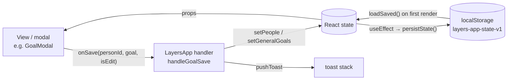

# State, data model & persistence

## Where state lives

All app state is `useState` in `LayersApp` ([`src/App.jsx`](../../src/App.jsx)). Screens receive slices as
props, and they receive mutations as `on*` callbacks that point at `handle*` functions
in `LayersApp`. Child components never call a setter for shared data directly.



### Persisted state

These keys are saved as one JSON blob under `localStorage['layers-app-state-v1']` by
`persistState()` whenever any of them changes:

| Key | Type | Initial value (no save) |
|---|---|---|
| `people` | `Person[]` | `INITIAL_PEOPLE` (5 example people) |
| `journal` | `JournalEntry[]` | `INITIAL_JOURNAL` |
| `generalGoals` | `Goal[]` (`personId: null`) | `INITIAL_GENERAL_GOALS` |
| `events` | `Event[]` | `[]` |
| `skills` | `Skills` | `INITIAL_SKILLS` |
| `profile` | `{ name, focus }` | `{ name: '', focus: null }` |
| `onboarded` | `boolean` | `false` |
| `theme` | `'light' \| 'dark'` | `'light'` |

`localStorage['layers-last-notified-date']` stores the day the "haven't checked in"
desktop notification last fired, so it fires at most once a day.

### UI-only state (not persisted)

`screen`, `activeTab`, `coachInit`, toasts, every modal-open flag and its target
(`goalEditing`, `addInfoTarget`, …), `confirmState`, updater status, auto-launch flag,
app version, and `sheetLayer` (the DOM node sheets portal into).

## Data model

These shapes are inferred from the seed data and handlers. There are no runtime types.

```ts
type Person = {
  id: string; name: string; emoji: string;
  layer: 1 | 2 | 3 | 4;                       // see LAYERS
  overall: number;                            // 0–100 progress *within the current layer*
  dims: Record<'depth'|'trust'|'reciprocity'|'interaction'|'sharedExperiences'|'listening', number>; // each 0–100
  interests: InfoItem[]; preferences: InfoItem[]; plans: InfoItem[];
  experiences: InfoItem[]; important: InfoItem[]; // the five CATEGORIES
  goals: Goal[];
  history: HistoryPoint[];                    // layer-progress chart
  timeline: TimelineStep[];
  justLeveledUp?: boolean;                    // drives the level-up pulse; cleared by onClearLevelUpFlag
  lastChange?: { before: number; after: number; why: string[] };
};

type InfoItem = {
  id: string; emoji: string; text: string;
  at: string;                                 // 'YYYY-MM-DD': the day it was last mentioned or edited ("Last mentioned" is derived from it)
  updated?: string;                           // legacy label ('Today', '9 days ago'), only until backfilled
  temporary: boolean; archived: boolean;
};

type TimelineStep = {
  label: string;                              // 'First met', 'First personal conversation', …
  at: string;                                 // 'YYYY-MM-DD'
  date?: string;                              // legacy label ('2 months ago'), only until backfilled
};

type Goal = {
  id: string; personId: string | null;        // null = general/skill goal (generalGoals)
  category: 'relationship' | 'skill' | 'custom';
  type: string;                               // PRESETS key, or 'custom'
  title: string; description: string;
  dueDate?: string | null;                    // 'YYYY-MM-DD'
  progress: number;                           // 0–100; 100 = completed
  history: HistoryPoint[];
};

type HistoryPoint = { date: string /* "Sep 12" display label */; at?: string /* 'YYYY-MM-DD' sort key */; value: number };

type JournalEntry = {
  id: string; personId: string;
  at: string;                                 // 'YYYY-MM-DD': the day it happened (the picked date). Labels are derived from it.
  date?: string;                              // legacy label ('Today', 'Aug 31'), only until backfilled; see below
  type: 'talked'|'activity'|'messaged'|'hangout'|'called'|'other'|'analysed'; // TYPE_META
  meaningfulness: 1|2|3|4|5;
  added: string[];                            // note texts saved to the profile
  activeListening: string[];                  // AL_ITEMS keys
  summary?: string;
  analysis?: { grading: object; conversationState: string }; // from Coach → Analyse
};

type Event = {
  id: string; title: string; personIds: string[];
  kind: 'oneoff' | 'recurring';
  date?: string;                              // 'YYYY-MM-DD' (one-off)
  weekdays?: number[];                        // 0=Sun…6=Sat (recurring); legacy single `weekday` also read
  time?: number | null;                       // minutes since midnight
  defaultMeaningfulness?: number; createdAt: string;
};

type Skills = Record<'activeListening'|'followUp'|'reciprocity'|'selfDisclosure'|'readingCues'|'knowingWhenToStop',
  { label: string; current: number; history: { date: string; value: number }[] }>;
```

### Dates: store the day, derive the label

Every date in the data is an absolute ISO day. Nothing stores a relative label like
`'Today'` any more, because a stored label never ages.

- **Journal entries, info items and timeline steps** keep their day in `at`. The shared
  helpers `storedDay` / `storedDaysAgo` / `storedDateLabel` turn it into an age or a
  "3 days ago" label on every render, so labels age on their own. Each record type has a
  thin wrapper:
  - journal: `journalDateLabel`, `journalDaysAgo`, and `isJournalThisWeek` (the last 7
    days, rolling, not the calendar week). Used by the Journal, Home (recent activity,
    "being developed", the quiet-people list), the Coach's "Last time you spoke" hook and
    `getCheckInSuggestions`.
  - info items: `infoItemDateLabel` ("Last mentioned: …" on the profile) and
    `infoItemDaysAgo` (the 3- and 7-day thresholds in `generateSuggestions`, which feeds
    "Ideas for next time").
  - timeline: `timelineDateLabel`. The "Current: <layer>" step is added at render time
    with the text `'Now'` and no `at`, and the helper passes such text through unchanged.

  When you write one of these records, set `at: toISODate(day)`. A logged note uses the
  interaction's picked date, and adding or editing an item uses today. Never store a
  derived label.
- **Chart history points** carry a display label plus an ISO `at` key. `sortHistory`
  sorts and de-duplicates points by day, so logging twice on one day updates that day's point.
- **Events** store ISO dates because they can be in the future.

#### Records saved before `at` existed

Older data, and the seed `INITIAL_JOURNAL` / `INITIAL_PEOPLE`, only has labels: journal
`date` (plus a stale `isThisWeek` flag), info-item `updated` and timeline `date`.
`backfillJournalDates` and `backfillPeopleDates` give each record an `at` when data is
loaded from `localStorage`, when a backup is imported, and when sample data is loaded.
Both use the same `backfillDated` routine. It removes the legacy label once `at` is set,
and it skips records that already have an `at`, so each record is dated once and then
never moves.

- **Absolute labels** (`'Aug 31'`, `'Aug 20, 2025'`) are parsed exactly by
  `parseAbsoluteLabel`. A label without a year means its most recent past occurrence.
- **Relative labels are ambiguous.** `'Today'` meant the day the entry was logged, and
  that day was never stored. They're read as of an *anchor* instead. For saved data the
  anchor is the first launch after the upgrade. For an import it's the backup's
  `exportedAt` (no label in a backup can be newer than the export), falling back to now if
  `exportedAt` is missing or invalid. The real log date can't be later than the anchor, so
  a backfilled date is never *earlier* than the real one. A person last logged as
  "Today" weeks ago therefore starts aging from the anchor, rather than being flagged as
  overdue immediately. `'N months ago'` stays approximate (30-day months).
- **Unreadable labels** are left alone. The record shows its label text as-is and counts
  as long ago (999 days), which is what `parseDaysAgo` did before.

## Progression model

**Logging an interaction** (`handleLogSubmit`):

1. Each of the six dimensions gets a bump based on meaningfulness, interaction type and
   active-listening ticks (clamped to 0–100).
2. **Layer progress (`overall`) only moves for meaningfulness ≥ 4.** The bump is
   `round(avg(dimension bumps) × 0.55)`.
3. `advanceLayer(layer, overall, bump)` treats each layer as its own 0–100 meter.
   Reaching 100 moves up a layer (max 4) and carries the overflow into the new layer.
   A level-up sets `justLeveledUp` and pushes a 🎉 toast.
4. Every unfinished goal for that person gains `round(meaningfulness × 3.2)`.
5. Notes are added to the matching info category, a journal entry is prepended, and
   global skills get small bumps.

**Other paths:**

- `handleLogFromAnalysis` follows the same pattern from a Coach scenario's grading.
  Progress only moves when the grading's overall score is ≥ 70.
- `handleAdjust` (manual sliders) re-derives the layer from the dimension average using
  the original bands (`layerForOverall`: <25 / <50 / <75 / ≥75), then sets `overall` to
  the position within that band.
- `handleBumpGoal` ("Mark progress") adds +20 to a goal, and a toast celebrates reaching 100.

## Backup format

The Me tab's **Export** writes `layers-backup-YYYY-MM-DD.json`:

```json
{ "version": 1, "exportedAt": "ISO timestamp", "people": [], "journal": [], "generalGoals": [], "events": [], "skills": {}, "profile": {} }
```

**Import** asks for confirmation and then *replaces* all of that state. Fields that are
missing or have the wrong type fall back to empty values. It does no schema or version
migration, apart from dating records that have no `at` (see
[above](#records-saved-before-at-existed)), so old backups still import. Records in new
backups have `at` and no legacy label. An app older than 1.0.25 would show them without a
date label.
