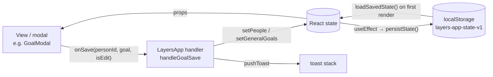

# State, data model & persistence

## Where state lives

All app state is `useState` in `LayersApp` ([`src/App.jsx`](../../src/App.jsx)). Screens receive slices as
props, and they receive mutations as `on*` callbacks that point at `handle*` functions
in `LayersApp`. Child components never call a setter for shared data directly.



### Persisted state

These keys are saved as one JSON blob under `localStorage['layers-app-state-v1']` by
`persistState()` whenever any of them changes:

| Key | Type | Initial value (no save) |
|---|---|---|
| `people` | `Person[]` | `INITIAL_PEOPLE` (5 example people) |
| `journal` | `JournalEntry[]` | `INITIAL_JOURNAL` |
| `generalGoals` | `Goal[]` (`personId: null`) | `INITIAL_GENERAL_GOALS` |
| `events` | `Event[]` | `[]` |
| `skills` | `Skills` | `INITIAL_SKILLS` |
| `profile` | `Profile` | `{ name: '', focus: null }` |
| `onboarded` | `boolean` | `false` |
| `themeMode` | `'system' \| 'light' \| 'dark'` | `'system'`: Match Windows. Saves from before 2026-10-05 have none, so they follow Windows too (the owner's choice). |
| `theme` | `'light' \| 'dark'`: what's showing, worked out from `themeMode` | `'light'` |
| `achievements` | `{ [key]: 'YYYY-MM-DD' }`, or `null` until worked out | `null` (saved as `{}`). See [Achievements](#achievements). |

Three more keys belong to notifications ([below](#notifications)):
- `layers-last-notified-date`: the day the check-in nudge last fired
- `layers-notified-reminders`: notifications Layers already showed itself, in a browser
- `layers-snoozes`: snoozed reminders

`useToday` ([`src/lib/hooks.js`](../../src/lib/hooks.js)) holds the local date. It
notices a new day within a minute of midnight, or as soon as the window becomes visible
again. `LayersApp` passes `today` to `TodayView`, `PersonProfile` and `JournalView`, whose
cached date maths (the day plan, ideas, profile suggestions,
goal due labels, the journal's period filters) runs from it, so it refreshes at midnight
even when the app has been in the tray for days.

### Loading saved data

`loadSavedState()` in [`lib/storage.js`](../../src/lib/storage.js) runs once, on the
first render. It checks the saved state with `validateBackup`, the same check an import
gets ([below](#backup-format)). It passes `source: 'saved'`, which only changes the
wording of the warnings ("for people who are no longer in your circle" instead of "not in
the backup"). It returns `{ state, problem }`:

| Saved data | Result |
|---|---|
| None, or storage disabled | `state: null`, so the initial values above and onboarding |
| Valid | Loaded as it is, then dated by the `backfill*` helpers |
| Some records damaged | Repaired or skipped as for an import. `problem.kind` is `'repaired'`, and an OK-only notice lists what was skipped. |
| Not JSON, not an object, or refused by `validateBackup` | `state: null` and `problem.kind: 'unreadable'`. Layers starts fresh, and a notice explains and suggests importing a backup. |

In both problem cases the original text is first copied to
`localStorage['layers-app-state-v1-unreadable-<ISO time>']` (`UNREADABLE_PREFIX`), so the
next save can't destroy it. The same text is only copied once. If storage is full the copy
can't be kept, and the notice says so (`copyKept`). Before 1.0.27, unreadable data was
silently replaced by the sample people, and the next save overwrote it for good.

`persistState` returns `false` when a write fails (storage full or disabled). The persist
effect in `LayersApp` then shows one toast suggesting a backup export. It stays quiet
for later failures until a save has worked again (the `saveFailed` ref).

### UI-only state (not persisted)

`screen`, `activeTab`, `coachInit`, `searchFocus` (which search box `/` should focus once
its tab renders), toasts, every modal-open flag and its target (`goalEditing`,
`addInfoTarget`, `editingEntryId`, …), `confirmState`, updater status, auto-launch flag,
shortcut status, app version, and `sheetLayer` (the DOM node sheets portal into).

## Data model

These shapes are inferred from the seed data and handlers. There are no runtime types.

```ts
type Person = {
  id: string; name: string; emoji: string;
  layer: 1 | 2 | 3 | 4;                       // see LAYERS
  overall: number;                            // 0–100 progress *within the current layer*
  dims: Record<'depth'|'trust'|'reciprocity'|'interaction'|'sharedExperiences'|'listening', number>; // each 0–100
  interests: InfoItem[]; preferences: InfoItem[]; plans: InfoItem[];
  experiences: InfoItem[]; important: InfoItem[]; // the five CATEGORIES
  goals: Goal[];
  history: HistoryPoint[];                    // layer-progress chart
  timeline: TimelineStep[];
  justLeveledUp?: boolean;                    // drives the level-up pulse; cleared by onClearLevelUpFlag
  lastChange?: {                              // the profile's change card; written by movePerson
    before: number; after: number;            // `overall` before and after
    beforeLayer?: number; afterLayer?: number; // since 1.0.27; older records mean "the current layer"
    why: string[];
  };
};

type InfoItem = {
  id: string; emoji: string; text: string;
  at: string;                                 // 'YYYY-MM-DD': the day it was last mentioned or edited ("Last mentioned" is derived from it)
  updated?: string;                           // legacy label ('Today', '9 days ago'), only until backfilled
  temporary: boolean; archived: boolean;
};

type TimelineStep = {
  label: string;                              // 'First met', 'Reached Layer 3: …', 'Moved to Layer 2: …', …
  at: string;                                 // 'YYYY-MM-DD'
  date?: string;                              // legacy label ('2 months ago'), only until backfilled
};

type Goal = {
  id: string; personId: string | null;        // null = general/skill goal (generalGoals)
  category: 'relationship' | 'skill' | 'custom';
  type: string;                               // PRESETS key, or 'custom'
  title: string; description: string;
  dueDate?: string | null;                    // 'YYYY-MM-DD'
  progress: number;                           // 0–100; 100 = completed
  history: HistoryPoint[];
};

type HistoryPoint = {
  date: string;                               // "Sep 12" display label
  at?: string;                                // 'YYYY-MM-DD' sort key
  value: number;
  layer?: number;                             // person history only: the layer `value` is a percentage of (since 1.0.27)
};

type JournalEntry = {
  id: string; personId: string;
  at: string;                                 // 'YYYY-MM-DD': the day it happened (the picked date). Labels are derived from it.
  date?: string;                              // legacy label ('Today', 'Aug 31'), only until backfilled; see below
  type: 'talked'|'activity'|'messaged'|'hangout'|'called'|'other'|'analysed'; // TYPE_META
  meaningfulness: 1|2|3|4|5;
  added: string[];                            // note texts saved to the profile
  activeListening: string[];                  // AL_ITEMS keys
  summary?: string;                           // the note
  reflection?: string;                        // "How did it feel?" (the log's More details, or Edit entry)
  ratings?: { [dimension]: 1|2|3|4|5 };       // "How did each part go?" (More details); only rated dimensions
  standouts?: string[];                       // older 1.0.28 builds' "What stood out?" picks; shown, no longer written
  analysis?: { grading: object; conversationState: string }; // from Coach → Analyse
};

type Event = {                                // a plan on the calendar; see The calendar
  id: string; title: string; personIds: string[];
  kind: 'oneoff' | 'recurring';
  date?: string;                              // 'YYYY-MM-DD' (one-off)
  weekdays?: number[];                        // 0=Sun…6=Sat (recurring; all seven = daily); legacy single `weekday` also read
  from?: string;                              // recurring: the first day it applies (1.0.30+; older ones have always applied)
  time?: number | null;                       // minutes since midnight; null for all day
  allDay?: boolean;
  duration?: number;                          // minutes; missing means 60
  alert?: number | null;                      // minutes before to notify; null = none; missing means 0 (at the time, as before 1.0.30)
  template?: string;                          // EVENT_TEMPLATES key: the emoji, and the type a log of it gets
  updatedAt?: string;                         // ISO timestamp of the last change (for syncing later)
  defaultMeaningfulness?: number;
  goalId?: string;                            // one of its people's goals; logging the reminder moves only that goal
  doneAt?: string;                            // one-off: the day it was marked done. It's finished for good.
  doneDays?: string[];                        // recurring: recent days marked done or skipped (last 14; older saves have one doneOn)
  createdAt: string;                          // 'YYYY-MM-DD' ('Today' before 1.0.27)
};

type Profile = {
  name: string;
  focus: string | null;                       // FOCUS_OPTIONS key: 'new' | 'deepen' | 'skills' | 'mix'
  reminderNotifications?: boolean;            // Me → Notifications; missing means on (all of these: NOTIFY_DEFAULTS)
  defaultAlert?: number | null;               // the reminder new plans start with (15)
  morningSummary?: boolean; morningTime?: number;   // on, 8:00 AM (minutes since midnight)
  eveningHeadsUp?: boolean; eveningTime?: number;   // on, 8:00 PM
  askAfter?: boolean;                         // "How did it go?" when a plan with people ends; on
  checkInNotifications?: boolean;             // Me → Notifications; missing means on
};

type KeyDate = {                              // Person.dates: birthdays and other days for the calendar
  id: string; kind: 'birthday' | 'anniversary' | 'exam' | 'bigday' | 'custom';
  date: string;                               // 'YYYY-MM-DD'; a yearly one matches month and day every year
  yearly: boolean;
  label?: string;                             // custom ones' own wording
};

type Skills = Record<'activeListening'|'followUp'|'reciprocity'|'selfDisclosure'|'readingCues'|'knowingWhenToStop',
  { label: string; current: number; history: HistoryPoint[] }>;
```

### Dates: store the day, derive the label

Every date in the data is an absolute ISO day. Nothing stores a relative label like
`'Today'` any more, because a stored label never ages.

- **Journal entries, info items and timeline steps** keep their day in `at`. The shared
  helpers `storedDay` / `storedDaysAgo` / `storedDateLabel` turn it into an age or a
  "3 days ago" label on every render, so labels age on their own. Each record type has a
  thin wrapper:
  - journal: `journalDateLabel`, `journalDaysAgo`, and `isJournalThisWeek` (the last 7
    days, rolling, not the calendar week). Used by the Journal, Me ("being developed"), the calendar's ideas, the Coach's "Last time you spoke" hook and
    `getCheckInSuggestions`.
  - info items: `infoItemDateLabel` ("Last mentioned: …" on the profile) and
    `infoItemDaysAgo` (the 3- and 7-day thresholds in `generateSuggestions`, which feeds
    "Ideas for next time").
  - timeline: `timelineDateLabel`. **The timeline always shows the calendar date**
    (`'Sep 26'`, or `'Aug 4, 2025'` for another year) and never a relative label, because
    it's a record of when things happened. Steps are shown in date order (`sortByDay`),
    so a step added for a backdated log lands where it belongs. The "Current: Layer N,
    <name>" step is added at render time with `at: today` and the prefix "As of ".

  When you write one of these records, set `at: toISODate(day)`. A logged note uses the
  interaction's picked date, and adding or editing an item uses today. Never store a
  derived label.
- **Chart history points** carry a display label plus an ISO `at` key. `sortHistory`
  sorts and de-duplicates points by day, so logging twice on one day updates that day's
  point. A backdated log never adds a point in the past (`chartDay`, see
  [Charts and the timeline](#charts-and-the-timeline)).
- **Events** store ISO dates because they can be in the future.

#### Records saved before `at` existed

Older data, and the seed `INITIAL_JOURNAL` / `INITIAL_PEOPLE`, only has labels: journal
`date` (plus a stale `isThisWeek` flag), info-item `updated` and timeline `date`.
`backfillJournalDates` and `backfillPeopleDates` give each record an `at` when data is
loaded from `localStorage`, when a backup is imported, and when the sample people are
loaded (onboarding, or Me → "Add sample people").
Both use the same `backfillDated` routine. It removes the legacy label once `at` is set,
and it skips records that already have an `at`, so each record is dated once and then
never moves.

- **Absolute labels** (`'Aug 31'`, `'Aug 20, 2025'`) are parsed exactly by
  `parseAbsoluteLabel`. A label without a year means its most recent past occurrence.
- **Relative labels are ambiguous.** `'Today'` meant the day the entry was logged, and
  that day was never stored. They're read as of an *anchor* instead. For saved data the
  anchor is the first launch after the upgrade. For an import it's the backup's
  `exportedAt` (no label in a backup can be newer than the export), falling back to now if
  `exportedAt` is missing or invalid. The real log date can't be later than the anchor, so
  a backfilled date is never *earlier* than the real one. A person last logged as
  "Today" weeks ago therefore starts aging from the anchor, rather than being flagged as
  overdue immediately. `'N months ago'` stays approximate (30-day months).
- **Unreadable labels** are left alone. The record shows its label text as-is and counts
  as long ago (999 days), which is what `parseDaysAgo` did before.

Skill history in the sample data uses bare month labels (`'Sep'` … `'Jan'`), which can't
be sorted against new points. `backfillSkillDates` gives each one the 1st of its month,
walking back from the newest point so the months stay in order across a year boundary
(`'Jan'` is this January, `'Dec'` the one before). It runs at the same three moments.

## Progression model

The helpers are in [`lib/progress.js`](../../src/lib/progress.js) and unit-tested in
`src/progress.test.js`.

**Logging an interaction** (`handleLogSubmit`). The log sheet always sends the people,
type, meaningfulness, profile notes, active-listening ticks, the note (`summary`) and the
picked date. Its optional **More details** section can add three more inputs:

- `ratings`: "How did each part go?", a 1–5 rating for any of the six dimensions
  (`DIM_QUESTIONS` holds the questions). With More details open, typing a number rates
  the highlighted row and moves down; Backspace steps back and clears; the arrows move.
- `goalIds`: the goals left ticked under "Goals this moved". `undefined` means every
  active goal of each person in the log, and the sheet sends `undefined` unless you
  untick one. A logged reminder that's linked to a goal sends just that goal.
- `reflection`: "How did it feel?", saved on the journal entry.

Then:

1. Each of the six dimensions gets a bump (`dimBumps` in
   [`lib/progress.js`](../../src/lib/progress.js)). A **rated** dimension grows by its
   rating: `round(rating × 2.2)`, so 1 → +2, 3 → +7, 5 → +11, plus the active-listening
   bonus for reciprocity and listening. An unrated one uses the original formula with
   meaningfulness, interaction type and active-listening ticks. The ratings are listed
   in the `why` ("You rated it: Depth 4, Trust 5"). Dimensions are clamped to 0–100.
2. **Layer progress (`overall`) only moves for meaningfulness ≥ 4.** The bump is
   `round(avg(dimension bumps) × 0.55)`.
3. `advanceLayer(layer, overall, bump)` treats each layer as its own 0–100 meter.
   Reaching 100 moves up a layer (max 4) and carries the overflow into the new layer.
   Every person's result is worked out in one pass, so a group log toasts every level-up.
   Then `keepDimsInLayer` keeps the dimensions inside the (new) layer's band
   ([below](#dimensions-stay-inside-the-layer)).
4. Every unfinished goal for that person gains `round(meaningfulness × 3.2)`, or only the
   goals in `goalIds` when it's given. An unticked goal stays where it is. A goal about
   one dimension (`GOAL_PRESET_DIM`: "Have deeper conversations" and depth, "Spend more
   time together" and shared experiences, ...) uses that dimension's rating instead when
   it was rated (`goalBumpFor`).
5. Topics picked with "+ Add detail" are saved to the profile, but only when the log is
   with one person; a group log keeps them in its note. `NOTE_TEMPLATE_CATEGORY` in
   [`data/constants.js`](../../src/data/constants.js) says where each template category
   goes: hobby-type topics become `interests`, and school/work and life topics become
   temporary `important` items, which Prepare turns into "ask how it went". Custom text
   stays in the note. More details' "Something new about …?" is saved the same way,
   into the category you picked (one-person logs only). A topic that's already saved
   (same text, ignoring case) gets its `at` refreshed and leaves the archive, rather than
   being added twice (`addNotes` in `App.jsx`).
6. A journal entry is prepended, with `ratings` and `reflection` when they're given.
   Global skills get small bumps (`bumpSkills`), and skill goals whose skill went up move
   with it ([below](#skill-goals-move-with-skills)).

**Other paths:**

- `handleLogFromAnalysis` follows the same pattern from a Coach scenario's grading.
  Progress only moves when the grading's overall score is ≥ 70. Goals gain exactly the
  `goalImpact` the review shows as "Goal progress: +N%". Coach remembers what was saved
  and logged for each person and sample, so the same analysis can't be logged twice.
- `handleAdjust` (manual sliders): see [Adjust](#adjust) below.
- `handleBumpGoal` ("Mark progress") adds +20 to a goal, and a toast celebrates reaching 100.
- `handleUpdateEntry` and `handleDeleteEntry` (the Journal's pencil, `EditEntryModal`)
  change the record, not progress. You can change an entry's date, type,
  meaningfulness, note and reflection, or delete it after a confirmation. What the entry
  already added to the person, their goals and your skills stays, because later progress
  may have been built on it, and the sheet says so. Editing removes a legacy `date` label
  so it can't contradict the new `at`. An analysis keeps its `analysed` type.

### Skill goals move with skills

Each "My skills" goal preset follows one skill. `SKILL_GOAL_PRESETS` in
[`data/constants.js`](../../src/data/constants.js) maps them: `followUpQ` → `followUp`,
`fewerQuestions` and `reciprocal` → `reciprocity`, `recognizeSpace` →
`knowingWhenToStop`, and so on. `handleLogSubmit` and `handleLogFromAnalysis` work out
the new skills first. `raisedSkills(before, after)` lists the skills that went up, and
`advanceSkillGoals(goals, raised)` adds `SKILL_GOAL_STEP` (+20) and a chart point to every
unfinished goal that follows one of them. It runs over the general goals and the goals
of the people in the log. Before 1.0.28 skill goals only moved with "Mark progress".

### Moving a person

Logging, Coach and Adjust all finish with
`movePerson(p, { layer, overall, at, why, extra })`. It sets the new layer and
percentage plus any `extra` fields (dimensions, goals, info items), and records:

- **`lastChange`** with `before`/`after` percentages, `beforeLayer`/`afterLayer` and the
  `why` list. The profile's change card names both layers when they differ and counts
  the gain through them with `progressDelta`, which treats each layer as 100%: Layer 2 at
  90% → Layer 3 at 4% is +14%, not "+0%".
- **A history point** with its `layer`, so People's trend arrows read a level-up
  (Layer 2 at 95% → Layer 3 at 5%) as a rise.
- **A dated timeline step** ("Reached Layer 3: …" or "Moved to Layer 2: …") whenever the
  layer changes.
- **`justLeveledUp`** when the layer goes up, for the profile's level-up pulse.

### Charts and the timeline

`chartDay(history, at)` picks the day for a new chart point. A point never lands before
the newest one already on the chart: a backdated log changes progress *now*, so it's
recorded on that newest day. It used to be written at the old date, where it replaced
that day's point and made the line jump up and back down. Person and goal history both
use it.

`bumpSkills(skills, bumps, at)` raises skills and records a chart point, at most one per
skill per day. Before 1.0.27 nothing added points, so the Me tab's skills chart stayed
empty for anyone who didn't start with the sample data.

### Adjust

`placeOnLayers(avg)` maps the dimension average onto the layers absolutely. Each layer
is a 25-point band (`layerForOverall`: <25 / <50 / <75 / ≥75), and the position inside
the band is that layer's 0–100% meter.

- **Saving with nothing changed does nothing.** `PersonProfile` just closes the panel,
  and `handleAdjust` also checks `dimsEqual` and toasts "No changes".
- **Adjust previews the result.** Once a slider moves, a line under the sliders says where
  saving would put the person, and highlights a layer change.
- Moving up a layer toasts 🎉; moving down toasts too.

### Where new people start

`makePerson` gives every dimension `LAYER_BASE_DIMS[layer]`: `{ 1: 5, 2: 30, 3: 55, 4: 80 }`,
which is 20% into each 25-point band. It then sets `overall` with `placeOnLayers`, so a
new person starts at 20% of their layer, exactly where Adjust would place them. The
sample people in [`data/seed.js`](../../src/data/seed.js) are set the same way, and
`src/progress.test.js` checks that they are.

### Dimensions stay inside the layer

Adjust places people by their dimension average (25-point bands), but logging grows the
dimensions faster than layer progress, on purpose: a quick chat still credits the
dimensions, while only meaningful logs move the meter. They used to drift apart, so the
dimensions could describe a higher layer than the one shown, and Adjust would move the
person. P3, option C ([roadmap.md](../roadmap.md#p3-one-progress-model)) keeps them in
step:

- **`keepDimsInLayer(old, new, layer)`**, after every log and analysis. Growth that would
  push the average past the top of the layer's band is scaled down. The dimensions that
  grew most stay ahead, and none drops below where it was. A level-up lifts the
  dimensions to at least the bottom of the new band. `layerDimBounds` gives each band as
  a sum (Layer 3 is 297–446), because the average is rounded.
- **Saved data version 2.** `persistState` writes `dataVersion: 2`. A save without it gets
  `migrateDimsToLayers` once at startup (`loadSavedState`, which returns the
  `migrated` names), and so does an imported backup. Only people whose dimensions are
  outside their band move, scaled proportionally (`scaleDimsToSum`) to where their meter
  is, so Adjust then shows the layer and percentage they already have. Their layer and
  `overall` don't change. A one-time "Dimensions updated" notice names them.

Within a layer, Adjust can still change the percentage, since it places by the
dimensions. The preview shows both, for example "Saving puts Ana at Layer 3: Personal,
40% (now 72%)", before anything is saved.

## The calendar

Plans (`events`) are the calendar. [`lib/calendar.js`](../../src/lib/calendar.js) holds
its logic, as plain functions with no Electron or Windows in them, so it can move to a
phone later. It's unit-tested in `src/calendar.test.js`.

- **`occursOn(ev, day)`**: a one-off on its date; a repeating plan on its weekdays (all
  seven is daily), from its `from` day.
- **`dayAgenda(state, day)`**: one day's plan, as:
  - `allDay`: key dates, goals due and all-day plans
  - `timed`: plans with a time, in order, each with its start and end
  - `logged`: the journal entries for that day
- **`monthMarks`** gives the month grid's dots. Daily routines aren't counted, so special
  days stand out.
- **`needsAnswer`**: plans with people that have ended and aren't done, for **How did it
  go?** (**Log it** or **Just tick it**).
- **`usualGap`** and **`quietDay`**: how long you usually go between logs with someone
  (the middle of the gaps between their last seven logged days), and the day they count as
  gone quiet: half as long again (7 to 60 days), or their layer's quiet days (below) until
  there are three logged days.
- **`weekSummary(state, day)`**: the Monday-to-Sunday week around `day` for the weekly
  review: who was seen, interactions logged, plans done of planned (not daily routines),
  goals with a history point that week, and next week's Monday and plans.
- **`planIdeas`**: people it's been a while since you logged with, sooner the closer
  they are: 35 days for Layer 1, 21 for Layer 2, 14 for Layer 3, 7 for Layer 4. Only
  people with nothing planned in the next week.
- **`markDone(ev, day)`** (`lib/reminders.js`): a one-off gets `doneAt` and is finished
  for good; a repeating one adds the day to `doneDays` (the last 14). Logging a plan
  ticks it off for that day, and only its linked goal (`goalId`) moves.
- **`followUpEvent(person, item)`** makes a one-off like `Ask Sam how "Job interview"
  went` for three days later at 9:00 AM. It's the bell on a temporary detail in the
  profile.

### Notifications

`plannedNotifications(state, settings, from, to, snoozes)` lists every notification due
in a time window, oldest first. Each has a `tag` (unique per plan and day), a time,
`kind`, title, body, and the plan and day it's about:

| Kind | When | Says |
|---|---|---|
| `alert` | A plan's `alert` minutes before it (all-day: 9:00 AM) | The title; "In 15 minutes · 10:00 AM · with Priya" |
| `after` | When a plan with people ends, unless it's done (`askAfter`) | "How did it go with Priya?" |
| `morning` | `morningTime`, on days with something on | "Today: 3 things", and each in a line |
| `evening` | `eveningTime`, the night before a day with something on | "Tomorrow: …" |
| `snooze` | A snoozed reminder's time | The title, "Snoozed reminder" |
| `catchup` | `catchUpDay` (Saturday) at `morningTime`, when anyone's due a catch-up (`planIdeas`) | "Catch up this week: 3 people", "Priya (3 weeks) · …", with up to three people for Plan buttons |
| `quiet` | Noon on `quietDay()` for someone Personal or Close, unless something with them is planned or done in between | "It's been a while since you saw Priya": "11 days, longer than usual for you two" |
| `review` | Sundays at `reviewTime` (7:00 PM) | "Your week" |
| `date` | A person's key date: a week before and on the day (`morningTime`), and the evening before (`eveningTime`), unless `keyDateReminders` is off | "🎂 Priya's birthday is in a week", "🎂 Tomorrow: …", "🎂 Today: …" |

`useCalendarNotifications` in [`lib/hooks.js`](../../src/lib/hooks.js) delivers them:

- **In the Windows app** it hands the next 14 days to the main process
  (`layersSystem.scheduleNotifications`) whenever they change, and again every hour.
  Windows then shows them on time, even with Layers closed
  ([electron.md](../electron.md#notifications)).
  - A reminder (before a plan, or as it starts) only has snooze buttons (10 minutes,
    1 hour, Tomorrow). There's nothing to log or tick off until it has happened.
  - "How did it go?" has **Log it** and **Just tick it**.
  - Clicking a notification itself opens that day.
- **In a browser** it shows each one itself while Layers is open, within 15 minutes of its
  time, once (the tags are kept in `localStorage['layers-notified-reminders']`, the
  latest 200).

A button comes back as a `layers://` link (`parseActionUrl`), and `handleCalendarAction`
in `App.jsx` acts on it: it marks the plan done, snoozes it, opens the quick log filled in,
or shows the day. Snoozes (`{ id, eventId, day, at }`) live in
`localStorage['layers-snoozes']` until a day after they fire, not in the saved state or
backups.

The daily check-in nudge (`useDailyCheckIn`, `checkInNotifications`) still comes from the
page while Layers runs. Neither hook runs before onboarding.

## Achievements

`ACHIEVEMENTS` in [`data/constants.js`](../../src/data/constants.js) lists five.
[`lib/achievements.js`](../../src/lib/achievements.js) works out progress from your data:
`achievementProgress(people, journal, skills)` returns `{ done, have, need, unit }` for
each one, and `progressText` words it for a locked card ("2 of 5 conversations", "40% of
75%"). "Active Listener" counts conversations with at least one active-listening tick, as
its description says. It used to count ticks.

Once reached, an achievement is recorded in the `achievements` state with the day:
`{ firstMeaningful: '2026-10-04' }`. An effect in `LayersApp` calls
`newlyUnlocked(progress, achievements)` whenever people, the journal or skills change,
and records anything new. A recorded achievement stays unlocked even if the data changes
later, for example after you remove a person, and Me shows "Unlocked Oct 4". Up to
1.0.27 they were worked out on every render, so they could lock again.

`achievements` is saved with the rest of the state and goes into backups, where
`validateBackup` checks it ([below](#backup-format)). `null` means "not worked out yet":
saved data or a backup from before 1.0.28, or just after "Remove sample people" or
clearing skills and achievements when starting over. The effect then works them out from the data.

**Quiet recording.** Only achievements you reach by using the app get a toast ("🏅
Achievement unlocked: …"). Ones that loading data earns are recorded without one: at
startup, at onboarding, when the sample people are added or removed, and on import.
The `quietAchievements` ref starts `true` for startup, and those handlers set it again
before changing state. The effect reads it and clears it. It's also quiet while
`achievements` is `null` and before onboarding, so an upgrade doesn't announce everything
at once.

## Sample people

The five sample people (`INITIAL_PEOPLE` in [`data/seed.js`](../../src/data/seed.js)) can
sit beside your own. They keep fixed ids (`'alex'`, …), as do their example general
goals (`'gen-goal-1'`, …) and journal entries (`'j1'`, …), while your own records get ids
from `uid()`. `SAMPLE_PERSON_IDS` and `SAMPLE_GOAL_IDS` in `App.jsx` are how Me finds them.

- **Remove sample people** (`handleRemoveSample`, shown while any sample person is in your
  circle) removes them, their journal entries and the example general goals, and unlinks
  them from reminders. People you added stay. If your skills came with the samples
  (`skillsCameWithSamples`: their chart history still has the samples' month-only labels
  like `'Sep'`), skills go back to `EMPTY_SKILLS`, and the confirm dialog says so.
  Achievements are worked out again, quietly, from what's left, because the samples'
  ones weren't yours.
- **Add sample people** (`handleAddSample`, shown while any sample person is missing) adds
  the missing ones with their journal entries and example goals, and never replaces
  anything. It loads the example skill levels only if every skill is still 0%.

"Restore sample data", which replaced everything, was removed in 1.0.28. Onboarding's
"explore with example people" still loads the samples.

## Backup format

The Me tab's **Export** writes `layers-backup-YYYY-MM-DD.json`:

```json
{ "version": 1, "exportedAt": "ISO timestamp", "people": [], "journal": [], "generalGoals": [], "events": [], "skills": {}, "profile": {}, "achievements": {} }
```

`createBackup` in [`src/lib/backup.js`](../../src/lib/backup.js) builds it, and
`BACKUP_VERSION` is the format number.

**Import** checks the file with `validateBackup` *before* anything is replaced. The app's
own saved data gets the same check at startup ([Loading saved data](#loading-saved-data)).

| Situation | What happens |
|---|---|
| Not JSON, not an object, or no `people` list | Refused: "That file isn't a Layers backup." |
| `version` newer than `BACKUP_VERSION` | Refused: update Layers first |
| A top-level list (`people`, `journal`, `generalGoals`, `events`) or `skills`/`profile` has the wrong type | Refused as damaged, instead of silently importing it as empty |
| Larger than 20 MB (`MAX_BACKUP_BYTES`) | Refused before it's read |
| A person without an `id` or `name`, or a duplicate `id` | Skipped, and counted in the confirm dialog |
| A journal entry or event for a person who isn't in the backup; a goal without a title; a saved detail without text; an event without a title or valid date | Skipped and counted |
| Missing lists, out-of-range numbers, unknown types | Repaired: lists become empty, numbers are clamped (layer 1–4, dimensions and progress 0–100, meaningfulness 1–5), unknown interaction types become `other` |
| A journal entry's `summary` or `reflection` that isn't text, or `standouts` that isn't a list of strings | Repaired: a bad `summary` or `reflection` is dropped, because it's shown as it is, and `standouts` keeps only its strings |
| `achievements` missing or not an object | Read as `null`, so the app works them out again from the data, quietly ([Achievements](#achievements)) |
| An unknown achievement key, or a date that isn't `YYYY-MM-DD` | That entry is dropped |

Old backups without `version`, `events`, `generalGoals` or `achievements` still import.
The confirm dialog shows the export date, what will be imported ("5 people, 7 journal
entries, 10 goals, 1 event") and anything that will be skipped. After confirming, records
without an `at` are dated as described [above](#records-saved-before-at-existed), anchored to the
backup's `exportedAt`. A valid backup that the app exported comes back unchanged; the round
trip is unit-tested in `src/backup.test.js`. Records in new backups have `at` and no
legacy label, so an app older than 1.0.25 shows them without a date label.
