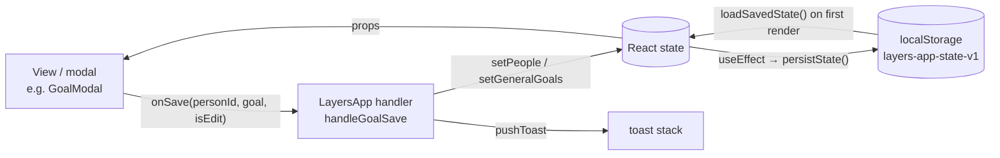

# State, data model & persistence

## Where state lives

All app state is `useState` in `LayersApp` ([`src/App.jsx`](../../src/App.jsx)). Screens receive slices as
props, and they receive mutations as `on*` callbacks that point at `handle*` functions
in `LayersApp`. Child components never call a setter for shared data directly.



### Persisted state

These keys are saved as one JSON blob under `localStorage['layers-app-state-v1']` by
`persistState()` whenever any of them changes:

| Key | Type | Initial value (no save) |
|---|---|---|
| `people` | `Person[]` | `INITIAL_PEOPLE` (5 example people) |
| `journal` | `JournalEntry[]` | `INITIAL_JOURNAL` |
| `generalGoals` | `Goal[]` (`personId: null`) | `INITIAL_GENERAL_GOALS` |
| `events` | `Event[]` | `[]` |
| `skills` | `Skills` | `INITIAL_SKILLS` |
| `profile` | `{ name, focus }` | `{ name: '', focus: null }` |
| `onboarded` | `boolean` | `false` |
| `theme` | `'light' \| 'dark'` | `'light'` |

`localStorage['layers-last-notified-date']` stores the local day (`YYYY-MM-DD`) the
"haven't checked in" desktop notification last fired, so it fires at most once a day.
`useDailyCheckIn` ([`src/lib/hooks.js`](../../src/lib/hooks.js)) checks 4 s after launch
and again whenever the local date changes. `useToday` notices the change within a minute
of midnight, or as soon as the window becomes visible again. `checkInReminder` in
`lib/text.js` decides whether it's due and words it. `LayersApp` also passes `today` to
`HomeView` and `PersonProfile`, whose cached date maths ("Upcoming", "haven't caught
up", weekly counts, profile suggestions, goal due labels) runs from it, so it refreshes
at midnight even when the app has been in the tray for days.

### Loading saved data

`loadSavedState()` in [`lib/storage.js`](../../src/lib/storage.js) runs once, on the
first render. It checks the saved state with `validateBackup`, the same check an import
gets ([below](#backup-format)). It passes `source: 'saved'`, which only changes the
wording of the warnings ("for people who are no longer in your circle" instead of "not in
the backup"). It returns `{ state, problem }`:

| Saved data | Result |
|---|---|
| None, or storage disabled | `state: null`, so the initial values above and onboarding |
| Valid | Loaded as it is, then dated by the `backfill*` helpers |
| Some records damaged | Repaired or skipped as for an import. `problem.kind` is `'repaired'`, and an OK-only notice lists what was skipped. |
| Not JSON, not an object, or refused by `validateBackup` | `state: null` and `problem.kind: 'unreadable'`. Layers starts fresh, and a notice explains and suggests importing a backup. |

In both problem cases the original text is first copied to
`localStorage['layers-app-state-v1-unreadable-<ISO time>']` (`UNREADABLE_PREFIX`), so the
next save can't destroy it. The same text is only copied once. If storage is full the copy
can't be kept, and the notice says so (`copyKept`). Before 1.0.27, unreadable data was
silently replaced by the sample people, and the next save overwrote it for good.

`persistState` returns `false` when a write fails (storage full or disabled). The persist
effect in `LayersApp` then shows one toast suggesting a backup export. It stays quiet
for later failures until a save has worked again (the `saveFailed` ref).

### UI-only state (not persisted)

`screen`, `activeTab`, `coachInit`, `searchFocus` (which search box `/` should focus once
its tab renders), toasts, every modal-open flag and its target (`goalEditing`,
`addInfoTarget`, …), `confirmState`, updater status, auto-launch flag, shortcut status,
app version, and `sheetLayer` (the DOM node sheets portal into).

## Data model

These shapes are inferred from the seed data and handlers. There are no runtime types.

```ts
type Person = {
  id: string; name: string; emoji: string;
  layer: 1 | 2 | 3 | 4;                       // see LAYERS
  overall: number;                            // 0–100 progress *within the current layer*
  dims: Record<'depth'|'trust'|'reciprocity'|'interaction'|'sharedExperiences'|'listening', number>; // each 0–100
  interests: InfoItem[]; preferences: InfoItem[]; plans: InfoItem[];
  experiences: InfoItem[]; important: InfoItem[]; // the five CATEGORIES
  goals: Goal[];
  history: HistoryPoint[];                    // layer-progress chart
  timeline: TimelineStep[];
  justLeveledUp?: boolean;                    // drives the level-up pulse; cleared by onClearLevelUpFlag
  lastChange?: {                              // the profile's change card; written by movePerson
    before: number; after: number;            // `overall` before and after
    beforeLayer?: number; afterLayer?: number; // since 1.0.27; older records mean "the current layer"
    why: string[];
  };
};

type InfoItem = {
  id: string; emoji: string; text: string;
  at: string;                                 // 'YYYY-MM-DD': the day it was last mentioned or edited ("Last mentioned" is derived from it)
  updated?: string;                           // legacy label ('Today', '9 days ago'), only until backfilled
  temporary: boolean; archived: boolean;
};

type TimelineStep = {
  label: string;                              // 'First met', 'Reached Layer 3: …', 'Moved to Layer 2: …', …
  at: string;                                 // 'YYYY-MM-DD'
  date?: string;                              // legacy label ('2 months ago'), only until backfilled
};

type Goal = {
  id: string; personId: string | null;        // null = general/skill goal (generalGoals)
  category: 'relationship' | 'skill' | 'custom';
  type: string;                               // PRESETS key, or 'custom'
  title: string; description: string;
  dueDate?: string | null;                    // 'YYYY-MM-DD'
  progress: number;                           // 0–100; 100 = completed
  history: HistoryPoint[];
};

type HistoryPoint = {
  date: string;                               // "Sep 12" display label
  at?: string;                                // 'YYYY-MM-DD' sort key
  value: number;
  layer?: number;                             // person history only: the layer `value` is a percentage of (since 1.0.27)
};

type JournalEntry = {
  id: string; personId: string;
  at: string;                                 // 'YYYY-MM-DD': the day it happened (the picked date). Labels are derived from it.
  date?: string;                              // legacy label ('Today', 'Aug 31'), only until backfilled; see below
  type: 'talked'|'activity'|'messaged'|'hangout'|'called'|'other'|'analysed'; // TYPE_META
  meaningfulness: 1|2|3|4|5;
  added: string[];                            // note texts saved to the profile
  activeListening: string[];                  // AL_ITEMS keys
  summary?: string;
  analysis?: { grading: object; conversationState: string }; // from Coach → Analyse
};

type Event = {
  id: string; title: string; personIds: string[];
  kind: 'oneoff' | 'recurring';
  date?: string;                              // 'YYYY-MM-DD' (one-off)
  weekdays?: number[];                        // 0=Sun…6=Sat (recurring); legacy single `weekday` also read
  time?: number | null;                       // minutes since midnight
  defaultMeaningfulness?: number;
  createdAt: string;                          // 'YYYY-MM-DD' ('Today' before 1.0.27)
};

type Skills = Record<'activeListening'|'followUp'|'reciprocity'|'selfDisclosure'|'readingCues'|'knowingWhenToStop',
  { label: string; current: number; history: HistoryPoint[] }>;
```

### Dates: store the day, derive the label

Every date in the data is an absolute ISO day. Nothing stores a relative label like
`'Today'` any more, because a stored label never ages.

- **Journal entries, info items and timeline steps** keep their day in `at`. The shared
  helpers `storedDay` / `storedDaysAgo` / `storedDateLabel` turn it into an age or a
  "3 days ago" label on every render, so labels age on their own. Each record type has a
  thin wrapper:
  - journal: `journalDateLabel`, `journalDaysAgo`, and `isJournalThisWeek` (the last 7
    days, rolling, not the calendar week). Used by the Journal, Home (recent activity,
    "being developed", the quiet-people list), the Coach's "Last time you spoke" hook and
    `getCheckInSuggestions`.
  - info items: `infoItemDateLabel` ("Last mentioned: …" on the profile) and
    `infoItemDaysAgo` (the 3- and 7-day thresholds in `generateSuggestions`, which feeds
    "Ideas for next time").
  - timeline: `timelineDateLabel`. **The timeline always shows the calendar date**
    (`'Sep 26'`, or `'Aug 4, 2025'` for another year) and never a relative label, because
    it's a record of when things happened. Steps are shown in date order (`sortByDay`),
    so a step added for a backdated log lands where it belongs. The "Current: Layer N,
    <name>" step is added at render time with `at: today` and the prefix "As of ".

  When you write one of these records, set `at: toISODate(day)`. A logged note uses the
  interaction's picked date, and adding or editing an item uses today. Never store a
  derived label.
- **Chart history points** carry a display label plus an ISO `at` key. `sortHistory`
  sorts and de-duplicates points by day, so logging twice on one day updates that day's
  point. A backdated log never adds a point in the past (`chartDay`, see
  [Charts and the timeline](#charts-and-the-timeline)).
- **Events** store ISO dates because they can be in the future.

#### Records saved before `at` existed

Older data, and the seed `INITIAL_JOURNAL` / `INITIAL_PEOPLE`, only has labels: journal
`date` (plus a stale `isThisWeek` flag), info-item `updated` and timeline `date`.
`backfillJournalDates` and `backfillPeopleDates` give each record an `at` when data is
loaded from `localStorage`, when a backup is imported, and when sample data is loaded.
Both use the same `backfillDated` routine. It removes the legacy label once `at` is set,
and it skips records that already have an `at`, so each record is dated once and then
never moves.

- **Absolute labels** (`'Aug 31'`, `'Aug 20, 2025'`) are parsed exactly by
  `parseAbsoluteLabel`. A label without a year means its most recent past occurrence.
- **Relative labels are ambiguous.** `'Today'` meant the day the entry was logged, and
  that day was never stored. They're read as of an *anchor* instead. For saved data the
  anchor is the first launch after the upgrade. For an import it's the backup's
  `exportedAt` (no label in a backup can be newer than the export), falling back to now if
  `exportedAt` is missing or invalid. The real log date can't be later than the anchor, so
  a backfilled date is never *earlier* than the real one. A person last logged as
  "Today" weeks ago therefore starts aging from the anchor, rather than being flagged as
  overdue immediately. `'N months ago'` stays approximate (30-day months).
- **Unreadable labels** are left alone. The record shows its label text as-is and counts
  as long ago (999 days), which is what `parseDaysAgo` did before.

Skill history in the sample data uses bare month labels (`'Sep'` … `'Jan'`), which can't
be sorted against new points. `backfillSkillDates` gives each one the 1st of its month,
walking back from the newest point so the months stay in order across a year boundary
(`'Jan'` is this January, `'Dec'` the one before). It runs at the same three moments.

## Progression model

The helpers are in [`lib/progress.js`](../../src/lib/progress.js) and unit-tested in
`src/progress.test.js`.

**Logging an interaction** (`handleLogSubmit`):

1. Each of the six dimensions gets a bump based on meaningfulness, interaction type and
   active-listening ticks (clamped to 0–100).
2. **Layer progress (`overall`) only moves for meaningfulness ≥ 4.** The bump is
   `round(avg(dimension bumps) × 0.55)`.
3. `advanceLayer(layer, overall, bump)` treats each layer as its own 0–100 meter.
   Reaching 100 moves up a layer (max 4) and carries the overflow into the new layer.
   Every person's result is worked out in one pass, so a group log toasts every level-up.
4. Every unfinished goal for that person gains `round(meaningfulness × 3.2)`.
5. Topics picked with "+ Add detail" are saved to the profile, but only when the log is
   with one person; a group log keeps them in its note. `NOTE_TEMPLATE_CATEGORY` in
   [`data/constants.js`](../../src/data/constants.js) says where each template category
   goes: hobby-type topics become `interests`, and school/work and life topics become
   temporary `important` items, which Prepare turns into "ask how it went". Custom text
   stays in the note. A topic that's already saved (same text, ignoring case) gets its
   `at` refreshed and leaves the archive, rather than being added twice (`addNotes` in
   `App.jsx`).
6. A journal entry is prepended, and global skills get small bumps (`bumpSkills`).

**Other paths:**

- `handleLogFromAnalysis` follows the same pattern from a Coach scenario's grading.
  Progress only moves when the grading's overall score is ≥ 70. Goals gain exactly the
  `goalImpact` the review shows as "Goal progress: +N%". Coach remembers what was saved
  and logged for each person and sample, so the same analysis can't be logged twice.
- `handleAdjust` (manual sliders): see [Adjust](#adjust) below.
- `handleBumpGoal` ("Mark progress") adds +20 to a goal, and a toast celebrates reaching 100.

### Moving a person

Logging, Coach and Adjust all finish with
`movePerson(p, { layer, overall, at, why, extra })`. It sets the new layer and
percentage plus any `extra` fields (dimensions, goals, info items), and records:

- **`lastChange`** with `before`/`after` percentages, `beforeLayer`/`afterLayer` and the
  `why` list. The profile's change card names both layers when they differ and counts
  the gain through them with `progressDelta`, which treats each layer as 100%: Layer 2 at
  90% → Layer 3 at 4% is +14%, not "+0%".
- **A history point** with its `layer`, so People's trend arrows read a level-up
  (Layer 2 at 95% → Layer 3 at 5%) as a rise.
- **A dated timeline step** ("Reached Layer 3: …" or "Moved to Layer 2: …") whenever the
  layer changes.
- **`justLeveledUp`** when the layer goes up, for the profile's level-up pulse.

### Charts and the timeline

`chartDay(history, at)` picks the day for a new chart point. A point never lands before
the newest one already on the chart: a backdated log changes progress *now*, so it's
recorded on that newest day. It used to be written at the old date, where it replaced
that day's point and made the line jump up and back down. Person and goal history both
use it.

`bumpSkills(skills, bumps, at)` raises skills and records a chart point, at most one per
skill per day. Before 1.0.27 nothing added points, so the Me tab's skills chart stayed
empty for anyone who didn't start with the sample data.

### Adjust

`placeOnLayers(avg)` maps the dimension average onto the layers absolutely. Each layer
is a 25-point band (`layerForOverall`: <25 / <50 / <75 / ≥75), and the position inside
the band is that layer's 0–100% meter.

- **Saving with nothing changed does nothing.** `PersonProfile` just closes the panel,
  and `handleAdjust` also checks `dimsEqual` and toasts "No changes".
- **Adjust previews the result.** Once a slider moves, a line under the sliders says where
  saving would put the person, and highlights a layer change.
- Moving up a layer toasts 🎉; moving down toasts too.

### Where new people start

`makePerson` gives every dimension `LAYER_BASE_DIMS[layer]`: `{ 1: 5, 2: 30, 3: 55, 4: 80 }`,
which is 20% into each 25-point band. It then sets `overall` with `placeOnLayers`, so a
new person starts at 20% of their layer, exactly where Adjust would place them. The
sample people in [`data/seed.js`](../../src/data/seed.js) are set the same way, and
`src/progress.test.js` checks that they are.

### What still disagrees

Logging and Adjust still use different maths. To Adjust, a 25-point rise in the
dimension average is a whole layer. Logging raises the dimensions by several points each
time but adds only about half the average bump to layer progress, and only for
meaningfulness 4 or 5. So after some logging the dimensions describe a higher layer
than the one shown, and moving any slider in Adjust re-places the person from those
dimensions, which can move them to another layer. The preview says so before you save.
Making the two agree is proposal P3 in [roadmap.md](../roadmap.md#proposals-need-a-go-ahead).

## Backup format

The Me tab's **Export** writes `layers-backup-YYYY-MM-DD.json`:

```json
{ "version": 1, "exportedAt": "ISO timestamp", "people": [], "journal": [], "generalGoals": [], "events": [], "skills": {}, "profile": {} }
```

`createBackup` in [`src/lib/backup.js`](../../src/lib/backup.js) builds it, and
`BACKUP_VERSION` is the format number.

**Import** checks the file with `validateBackup` *before* anything is replaced. The app's
own saved data gets the same check at startup ([Loading saved data](#loading-saved-data)).

| Situation | What happens |
|---|---|
| Not JSON, not an object, or no `people` list | Refused: "That file isn't a Layers backup." |
| `version` newer than `BACKUP_VERSION` | Refused: update Layers first |
| A top-level list (`people`, `journal`, `generalGoals`, `events`) or `skills`/`profile` has the wrong type | Refused as damaged, instead of silently importing it as empty |
| Larger than 20 MB (`MAX_BACKUP_BYTES`) | Refused before it's read |
| A person without an `id` or `name`, or a duplicate `id` | Skipped, and counted in the confirm dialog |
| A journal entry or event for a person who isn't in the backup; a goal without a title; a saved detail without text; an event without a title or valid date | Skipped and counted |
| Missing lists, out-of-range numbers, unknown types | Repaired: lists become empty, numbers are clamped (layer 1–4, dimensions and progress 0–100, meaningfulness 1–5), unknown interaction types become `other` |

Old backups without `version`, `events` or `generalGoals` still import. The confirm
dialog shows the export date, what will be imported ("5 people, 7 journal entries, 10
goals, 1 event") and anything that will be skipped. After confirming, records without an
`at` are dated as described [above](#records-saved-before-at-existed), anchored to the
backup's `exportedAt`. A valid backup that the app exported comes back unchanged; the round
trip is unit-tested in `src/backup.test.js`. Records in new backups have `at` and no
legacy label, so an app older than 1.0.25 shows them without a date label.
