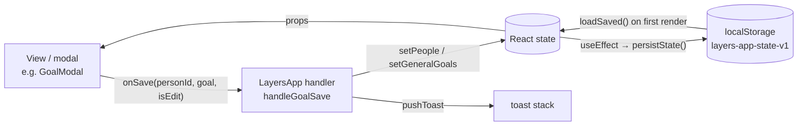

# State, data model & persistence

## Where state lives

All app state is `useState` in `LayersApp` (section **APP**). Screens receive slices as
props, and they receive mutations as `on*` callbacks that point at `handle*` functions
in `LayersApp`. Child components never call a setter for shared data directly.



### Persisted state

These keys are saved as one JSON blob under `localStorage['layers-app-state-v1']` by
`persistState()` whenever any of them changes:

| Key | Type | Initial value (no save) |
|---|---|---|
| `people` | `Person[]` | `INITIAL_PEOPLE` (5 example people) |
| `journal` | `JournalEntry[]` | `INITIAL_JOURNAL` |
| `generalGoals` | `Goal[]` (`personId: null`) | `INITIAL_GENERAL_GOALS` |
| `events` | `Event[]` | `[]` |
| `skills` | `Skills` | `INITIAL_SKILLS` |
| `profile` | `{ name, focus }` | `{ name: '', focus: null }` |
| `onboarded` | `boolean` | `false` |
| `theme` | `'light' \| 'dark'` | `'light'` |

`localStorage['layers-last-notified-date']` stores the day the "haven't checked in"
desktop notification last fired, so it fires at most once a day.

### UI-only state (not persisted)

`screen`, `activeTab`, `coachInit`, toasts, every modal-open flag and its target
(`goalEditing`, `addInfoTarget`, …), `confirmState`, updater status, auto-launch flag,
app version, and `sheetLayer` (the DOM node sheets portal into).

## Data model

These shapes are inferred from the seed data and handlers. There are no runtime types.

```ts
type Person = {
  id: string; name: string; emoji: string;
  layer: 1 | 2 | 3 | 4;                       // see LAYERS
  overall: number;                            // 0–100 progress *within the current layer*
  dims: Record<'depth'|'trust'|'reciprocity'|'interaction'|'sharedExperiences'|'listening', number>; // each 0–100
  interests: InfoItem[]; preferences: InfoItem[]; plans: InfoItem[];
  experiences: InfoItem[]; important: InfoItem[]; // the five CATEGORIES
  goals: Goal[];
  history: HistoryPoint[];                    // layer-progress chart
  timeline: { label: string; date: string }[];
  justLeveledUp?: boolean;                    // drives the level-up pulse; cleared by onClearLevelUpFlag
  lastChange?: { before: number; after: number; why: string[] };
};

type InfoItem = { id: string; emoji: string; text: string; updated: string /* relative label */; temporary: boolean; archived: boolean };

type Goal = {
  id: string; personId: string | null;        // null = general/skill goal (generalGoals)
  category: 'relationship' | 'skill' | 'custom';
  type: string;                               // PRESETS key, or 'custom'
  title: string; description: string;
  dueDate?: string | null;                    // 'YYYY-MM-DD'
  progress: number;                           // 0–100; 100 = completed
  history: HistoryPoint[];
};

type HistoryPoint = { date: string /* "Sep 12" display label */; at?: string /* 'YYYY-MM-DD' sort key */; value: number };

type JournalEntry = {
  id: string; personId: string;
  date: string;                               // RELATIVE label at time of logging: 'Today', '3 days ago'
  isThisWeek: boolean;                        // computed once at log time
  type: 'talked'|'activity'|'messaged'|'hangout'|'called'|'other'|'analysed'; // TYPE_META
  meaningfulness: 1|2|3|4|5;
  added: string[];                            // note texts saved to the profile
  activeListening: string[];                  // AL_ITEMS keys
  summary?: string;
  analysis?: { grading: object; conversationState: string }; // from Coach → Analyse
};

type Event = {
  id: string; title: string; personIds: string[];
  kind: 'oneoff' | 'recurring';
  date?: string;                              // 'YYYY-MM-DD' (one-off)
  weekdays?: number[];                        // 0=Sun…6=Sat (recurring); legacy single `weekday` also read
  time?: number | null;                       // minutes since midnight
  defaultMeaningfulness?: number; createdAt: string;
};

type Skills = Record<'activeListening'|'followUp'|'reciprocity'|'selfDisclosure'|'readingCues'|'knowingWhenToStop',
  { label: string; current: number; history: { date: string; value: number }[] }>;
```

### Dates: two different schemes

- **Journal entries and info items** store relative labels (`'Today'`, `'3 days ago'`),
  produced by `dateToRelativeLabel` and read back by `parseDaysAgo`. These labels are
  never refreshed. See [known-issues.md](../known-issues.md) for what that breaks.
- **Chart histories and events** store absolute dates. History points carry a display
  label plus an ISO `at` key. `sortHistory` sorts and de-duplicates points by day, so
  logging twice on one day updates that day's point. Events store ISO dates because they
  can be in the future.

## Progression model

**Logging an interaction** (`handleLogSubmit`):

1. Each of the six dimensions gets a bump based on meaningfulness, interaction type and
   active-listening ticks (clamped to 0–100).
2. **Layer progress (`overall`) only moves for meaningfulness ≥ 4.** The bump is
   `round(avg(dimension bumps) × 0.55)`.
3. `advanceLayer(layer, overall, bump)` treats each layer as its own 0–100 meter.
   Reaching 100 moves up a layer (max 4) and carries the overflow into the new layer.
   A level-up sets `justLeveledUp` and pushes a 🎉 toast.
4. Every unfinished goal for that person gains `round(meaningfulness × 3.2)`.
5. Notes are added to the matching info category, a journal entry is prepended, and
   global skills get small bumps.

**Other paths:**

- `handleLogFromAnalysis` follows the same pattern from a Coach scenario's grading.
  Progress only moves when the grading's overall score is ≥ 70.
- `handleAdjust` (manual sliders) re-derives the layer from the dimension average using
  the original bands (`layerForOverall`: <25 / <50 / <75 / ≥75), then sets `overall` to
  the position within that band.
- `handleBumpGoal` ("Mark progress") adds +20 to a goal, and a toast celebrates reaching 100.

## Backup format

The Me tab's **Export** writes `layers-backup-YYYY-MM-DD.json`:

```json
{ "version": 1, "exportedAt": "ISO timestamp", "people": [], "journal": [], "generalGoals": [], "events": [], "skills": {}, "profile": {} }
```

**Import** asks for confirmation and then *replaces* all of that state. Fields that are
missing or have the wrong type fall back to empty values. It does no schema or version
migration.
